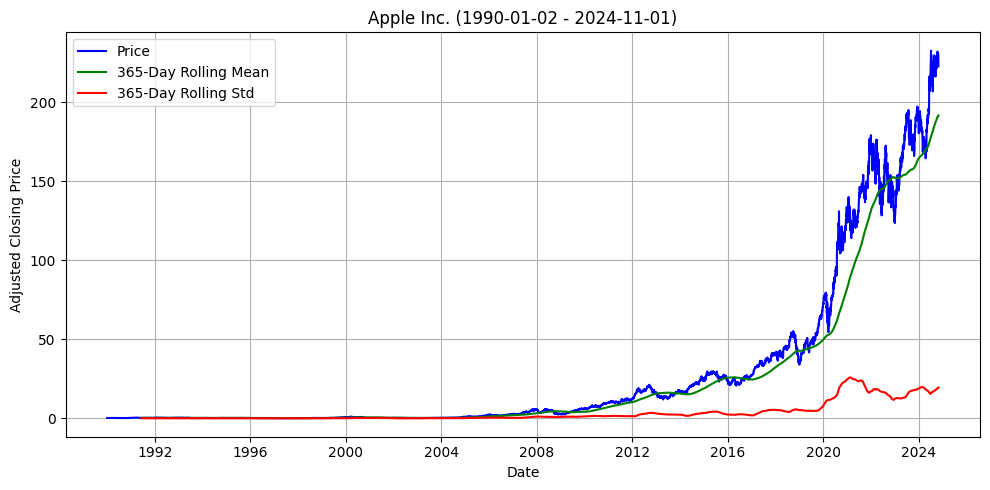
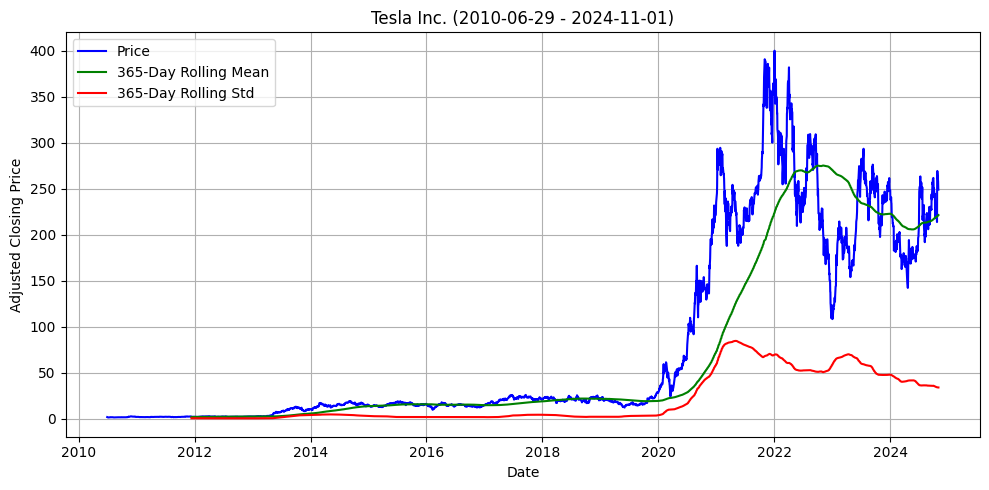
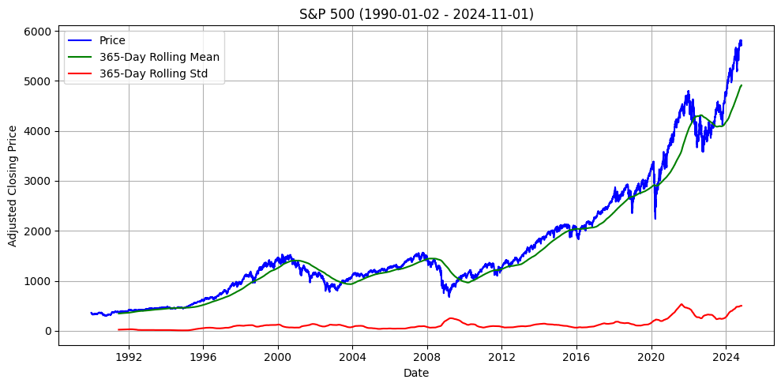
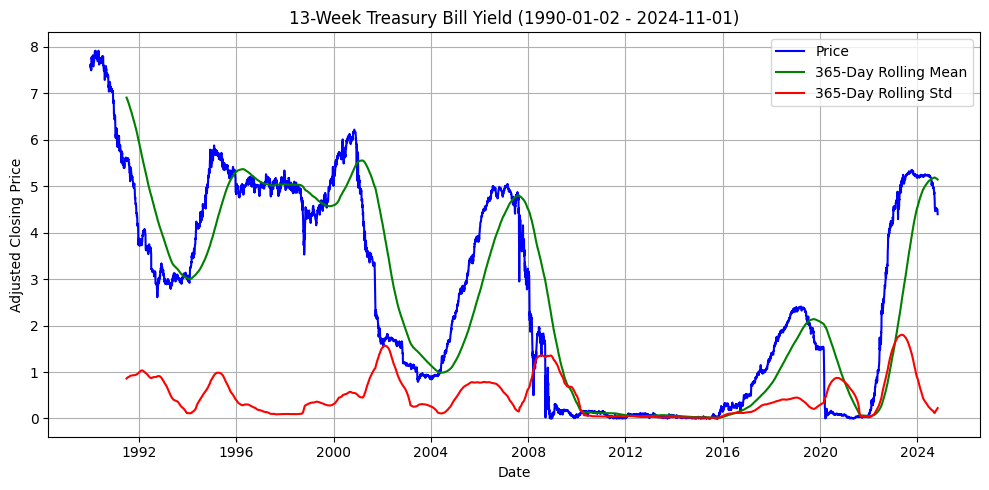
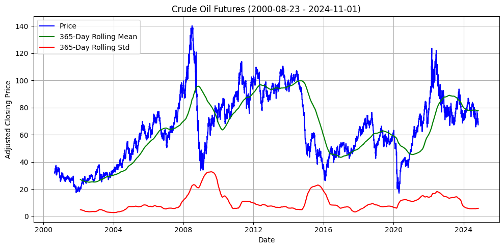
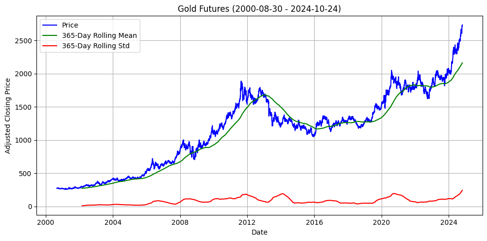
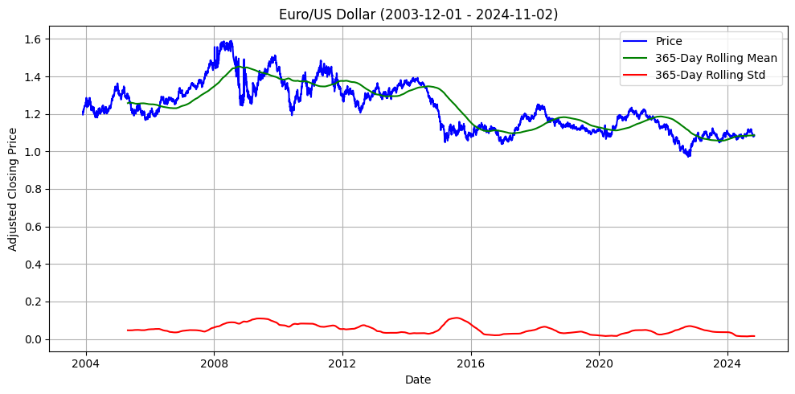
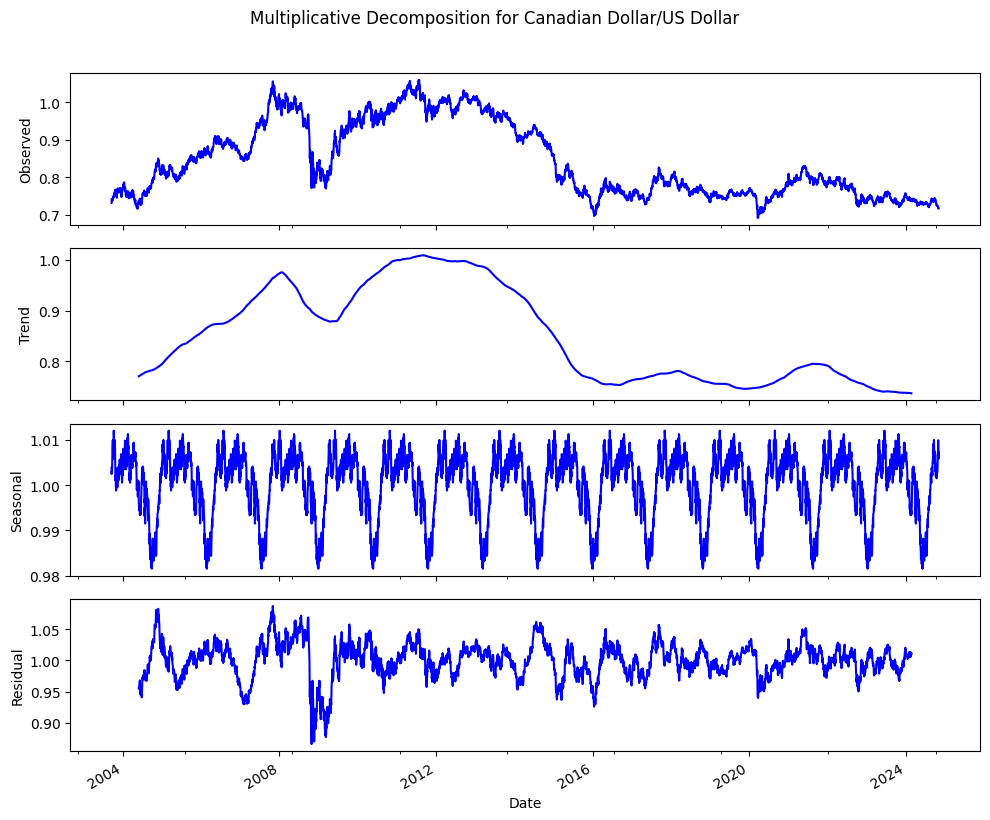
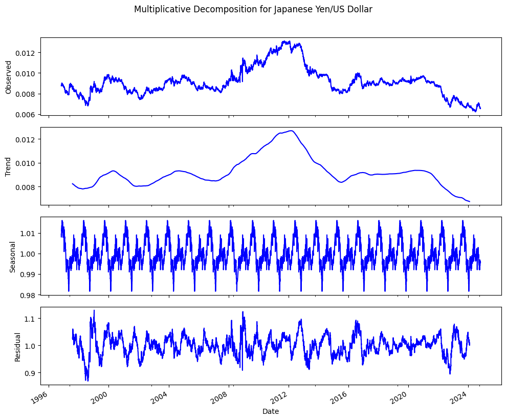

# **Описание задач и целей анализа финансовых временных рядов** #

Анализ временных рядов финансовых активов представляет собой комплексное исследование, направленное на выявление трендов, сезонных закономерностей, волатильности и других важных характеристик рынка. Основной целью данного анализа является построение структурированного понимания поведения цен различных активов, таких как акции, сырьевые товары, индексы, облигации и валюты. В результате этого исследования предполагается получить глубинные выводы, которые можно использовать для прогнозирования и стратегического планирования.

---

## **Задачи анализа включают:** ##

---

## **Сбор и предварительная обработка данных:** ##

Загрузка исторических данных для ключевых тикеров, включающих акции, сырьевые товары, индексы, облигации и валюты. На этом этапе производится проверка данных на полноту, частоту, отсутствие выбросов и корректное определение структуры.
Сегментация активов по классам: Для более целенаправленного анализа активы разделяются на категории — акции, сырьевые товары, индексы, облигации и валюты. Такая группировка позволяет учесть специфические характеристики каждого класса активов и проводить более релевантные сравнения.

---

## **Статистический анализ и вычисление основных метрик:** ##

Проведение описательной статистики по каждому активу, чтобы выявить основные статистические показатели (средние значения, медианы, стандартные отклонения и т.д.).
Построение автокорреляционных и частичных автокорреляционных функций для изучения временных зависимостей и влияния предыдущих значений на текущие.

---

## **Проверка стационарности временных рядов:** ##

Проведение тестов на стационарность (например, ADF, KPSS), чтобы определить, подвержены ли временные ряды изменению трендов и сезонности с течением времени. Стационарные ряды позволяют более надежно прогнозировать будущее, поскольку сохраняют стабильную структуру.

---

## **Выявление выбросов и аномалий:** ##

Очистка данных от экстремальных значений для предотвращения искажения статистики и аналитики. Обработка выбросов позволяет создать более точные модели и предотвратить влияние единичных событий на общую картину.

---

## **Декомпозиция временных рядов:** ##

Разделение временных рядов на компоненты тренда, сезонности и остатка. Это позволяет выделить долгосрочные тенденции и регулярные циклы, а также понять, какие отклонения вызваны случайными факторами.

---

## **Корреляционный анализ между активами:** ##

Определение степени взаимосвязи между различными классами активов для изучения поведения рынка в целом и выявления потенциальных защитных активов.

---

## **Учет макроэкономических факторов:** ##

Исследование взаимосвязи между активами и макроэкономическими показателями (такими как процентные ставки, инфляция и темпы роста экономики) для понимания реакции активов на изменения в экономической среде. Включение макроэкономических данных в мультифакторные модели риска помогает дать более точную оценку влияния внешних условий на поведение активов.

# **Методы анализа временных рядов финансовых активов** #

---

## **Декомпозиция временных рядов (STL):** ##

Используется метод Seasonal-Trend decomposition using LOESS (STL) для разложения временного ряда на тренд, сезонные и случайные компоненты. STL позволяет гибко настраивать сезонные и трендовые компоненты, что особенно важно для финансовых данных с переменной сезонностью. Этот метод позволяет изолировать длительные тенденции от циклических колебаний, упрощая интерпретацию основных движущих факторов.

---

## **Тесты на стационарность (ADF и KPSS):** ##

Для проверки стационарности применяются тесты Augmented Dickey-Fuller (ADF) и Kwiatkowski-Phillips-Schmidt-Shin (KPSS). ADF помогает выявить наличие единичного корня, указывающего на нестационарность ряда, тогда как KPSS проверяет гипотезу о стационарности по отношению к тренду. Эти тесты позволяют убедиться, что временной ряд подходит для моделирования, и при необходимости применять корректировки, такие как дифференцирование.

---

## **Автокорреляционная функция (ACF) и частичная автокорреляционная функция (PACF):** ##

ACF и PACF используются для анализа временной зависимости на разных временных лагах. ACF показывает, насколько текущие значения коррелируют с прошлыми, а PACF изолирует прямую зависимость текущего значения от значений на конкретных лагах, исключая влияние промежуточных. Эти функции помогают выбрать подходящие параметры для моделей, таких как ARIMA, что критично для прогнозирования временных рядов с автокорреляцией.

---

## **Фильтрация выбросов с помощью процентилей:** ##

Для очистки данных от экстремальных значений используется процентильная фильтрация. Этот метод помогает исключить редкие аномалии, вызванные, например, рыночными шоками, сохраняя при этом ключевые характеристики временного ряда. Процентильная фильтрация позволяет снизить влияние выбросов на статистические показатели и модели, делая данные более стабильными для анализа.

---

## **Корреляционный анализ (кросс-корреляция):** ##

Для оценки взаимосвязей между активами применяется кросс-корреляционный анализ. Этот метод выявляет степень зависимости между временными рядами на разных временных лагах, что позволяет понять, как активы из различных классов (например, акции и облигации) влияют друг на друга и обнаружить взаимосвязи, которые могут использоваться для хеджирования и минимизации риска.

---

## **Статистические метрики:** ##

Среднее, медиана, стандартное отклонение и другие базовые статистики дают общую характеристику распределения и волатильности актива. Эти метрики позволяют быстро оценить тенденции и уровень риска, что критично для понимания поведения актива и дальнейшего моделирования.

# **Этапы анализа и основные выводы:** #

## **Изучение структуры данных:** ##

**Описание этапа:**
На этом этапе проводится начальное изучение загруженных данных по каждому активу, включая проверку структуры колонок, типов данных, частоты данных и наличия пропусков. Это позволяет убедиться в корректности данных перед проведением дальнейшего анализа.

**Структура колонок:**

Данные для всех активов имеют единообразную структуру с основными ценовыми полями (открытие, максимум, минимум, закрытие,объем торгов).

| Open     | High     | Low      | Close    | Volume    | Ticker | Full Name   |
|----------|----------|----------|----------|-----------|--------|-------------|
| 0.314732 | 0.334821 | 0.3125   | 0.332589 | 183198400 | AAPL   | Apple Inc.  |
| 0.339286 | 0.339286 | 0.334821 | 0.334821 | 207995200 | AAPL   | Apple Inc.  |
| 0.341518 | 0.345982 | 0.332589 | 0.335938 | 221513600 | AAPL   | Apple Inc.  |
| 0.337054 | 0.341518 | 0.330357 | 0.337054 | 123312000 | AAPL   | Apple Inc.  |
| 0.334821 | 0.339286 | 0.330357 | 0.339286 | 101572800 | AAPL   | Apple Inc.  |

**Типы данных:**

Убедились, что типы данных корректны для финансового анализа, с float64 для ценовых данных и int64 для объема.

| index      | Data Type | Ticker | Full Name            |
|------------|-----------|--------|----------------------|
| Open       | float64   | JPM    | JPMorgan Chase & Co. |
| High       | float64   | JPM    | JPMorgan Chase & Co. |
| Low        | float64   | JPM    | JPMorgan Chase & Co. |
| Close      | float64   | JPM    | JPMorgan Chase & Co. |
| Adj Close  | float64   | JPM    | JPMorgan Chase & Co. |
| Volume     | int64     | JPM    | JPMorgan Chase & Co. |

**Пропуски:**

Пропуски отсутствуют, что позволяет проводить дальнейший анализ без значительной предварительной обработки.

| Column     | Missing Values | Ticker | Full Name   |
|------------|----------------|--------|-------------|
| Open       | 0              | ADBE   | Adobe Inc.  |
| High       | 0              | ADBE   | Adobe Inc.  |
| Low        | 0              | ADBE   | Adobe Inc.  |
| Close      | 0              | ADBE   | Adobe Inc.  |
| Adj Close  | 0              | ADBE   | Adobe Inc.  |
| Volume     | 0              | ADBE   | Adobe Inc.  |

**Обработка выбросов:**

Для устранения экстремальных значений был применен метод, основанный на 0.1% и 99.9% перцентилях. Этот подход помогает стабилизировать временные ряды и делает их более пригодными для долгосрочного прогнозирования, снижая влияние резких краткосрочных скачков, связанных с рыночными событиями. Удаление выбросов особенно важно для высоковолатильных активов, таких как технологические акции (например, TSLA(Tesla), META), которые подвержены резким колебаниям из-за спекулятивной активности и новостей. Исключение таких экстремальных значений улучшает предсказуемость для моделей, ориентированных на долгосрочные тренды.

**Сравнение выявленного стандартного отклонения в разрезе акций компаний разных секторов:**

| Тикер | Полное название       | Стандартное отклонение |
|-------|------------------------|------------------------|
| META  | META            |122.631116                  |
| MSFT  | Microsoft Corporation | 97.432832                  |
| TSLA  | Tesla Inc.            | 103.60127050                  |
| WMT  | Walmart Inc.       |14.808462                  |
| JPM  | JPMorgan Chase & Co         | 44.615780                 |

**Выбросы для AAPL (Найдено выбросов: 17)**

| Date                | Open       | ...       | Volume     |
|---------------------|------------|-----------|------------|
| 1997-07-01 00:00:00 | 0.124442   | ...       | 450676800  |
| 1997-07-02 00:00:00 | 0.118304   | ...       | 249961600  |
| 1997-07-10 00:00:00 | 0.114955   | ...       | 492508800  |
| 1997-12-23 00:00:00 | 0.117188   | ...       | 458830400  |
| 1997-12-24 00:00:00 | 0.116071   | ...       | 97832000   |
| ...                 | ...        | ...       | ...        |
| 2024-07-15 00:00:00 | 236.479996 | ...       | 62631300   |
| 2024-07-16 00:00:00 | 235.000000 | ...       | 43234300   |

**Очищенные данные для AAPL (Осталось после удаления: 8760)**

| Date                | Open       | ...       | Volume     |
|---------------------|------------|-----------|------------|
| 1990-01-02 00:00:00 | 0.314732   | ...       | 183198400  |
| 1990-01-03 00:00:00 | 0.339286   | ...       | 207995200  |
| 1990-01-04 00:00:00 | 0.341518   | ...       | 221513600  |
| ...                 | ...        | ...       | ...        |
| 1990-01-12 00:00:00 | 0.305804   | ...       | 171897600  |
| 1990-01-15 00:00:00 | 0.308036   | ...       | 161739200  |

## **Первичная визуализация:** ##

## **Агрегированные характеристики групп активов** ##

**Акции:**

Разнородность секторов среди акций делает их поведение зависимым от секторальных циклов и макроэкономических условий. Сектор высоких технологий (AAPL, MSFT, NVDA) демонстрирует восходящий тренд, основанный на инновационном потенциале и потребительском спросе, тогда как промышленный сектор (BA, CAT) более подвержен глобальным экономическим циклам и демонстрирует менее стабильную доходность.

**Особый случай:**

TSLA (Tesla), демонстрирующая повышенную волатильность из-за спекулятивных ожиданий, связанных с «зелеными» технологиями и уникальным стратегическим положением на рынке.

**Индексы акций:**

Основные фондовые индексы, такие как S&P 500, отражают общее состояние рыночных настроений и экономической активности. Они демонстрируют устойчивый рост с умеренной цикличностью, показывая меньшую волатильность, чем отдельные акции. Эти индексы надёжно отражают макроэкономическое состояние и фазы экономического цикла.

**Индексы облигаций:**

Облигационные индексы характеризуются низкой волатильностью и устойчивостью, отражая стабильность по сравнению с акциями и сырьевыми товарами. Их общий тренд предсказуем, с минимальными колебаниями, что делает их надёжным показателем в периоды нестабильности.

**С 2010 года доходность облигаций демонстрировала важные макроэкономические тенденции:**

**Длительный период низких ставок:**

Сразу после финансового кризиса 2008 года центральные банки, такие как ФРС США, установили крайне низкие процентные ставки для стимулирования экономики. Это привело к значительному снижению доходности облигаций, особенно долгосрочных, что сохранялось до середины 2010-х годов.

**Рост доходности в 2016–2018 годах:**

В этот период центральные банки начали постепенно повышать ставки в ответ на устойчивый экономический рост и стабилизацию рынков. Это вызвало заметный рост доходности, особенно в долгосрочных облигациях, что свидетельствует о росте ожиданий по инфляции и экономической активности.

**Пандемия COVID-19 и новый спад доходности (2020 год):**

В начале 2020 года на фоне пандемии доходность резко снизилась, особенно в краткосрочных облигациях, так как центральные банки вновь снизили ставки и начали стимулирующие программы. Этот период также характеризовался резким увеличением волатильности на рынке облигаций.

**Последний рост доходности (с 2022 года):**

В ответ на рост инфляции центральные банки снова начали повышать ставки, что привело к росту доходности облигаций. Долгосрочные облигации показали наибольший рост доходности, так как инвесторы пересматривали ожидания по инфляции и ставкам на ближайшие годы.

**Диверсификационные свойства:**

В периоды нестабильности, такие как пандемия, облигации продолжали использоваться как защитный актив, особенно долгосрочные. Их доходность снижалась при кризисах, что делало их важным элементом для диверсификации и снижения рисков в инвестиционных портфелях.

**Сырьевые товары:**

Сырьевые активы характеризуются глобально обусловленными колебаниями. Энергоресурсы, такие как нефть, обладают ярко выраженными циклами, зависящими от спроса и политической стабильности. Драгоценные металлы (золото) имеют тренд, слабо зависящий от экономического цикла, и выступают как «защитный актив» в условиях кризисов.

**Особый случай:**

Золото, стабильно растущее в периоды нестабильности, используемое как инфляционный хедж.

## **Валюты:** ##

**Долгосрочные тренды:**

Для всех валютных пар, таких как EUR/USD, CAD/USD, JPY/USD, GBP/USD и AUD/USD, видны долгосрочные тренды. Например, наблюдается общее укрепление и ослабление различных валют по отношению к доллару США в определённые периоды. Это может быть связано с глобальными экономическими циклами, кризисами и политическими событиями.
Видно, что евро и британский фунт переживали периоды значительного ослабления по отношению к доллару в последние годы, что может указывать на последствия экономической нестабильности в Еврозоне и Великобритании.

**Сезонные колебания:**

Сезонные компоненты на графиках демонстрируют незначительные регулярные колебания, особенно для CAD/USD и JPY/USD. Это может указывать на слабую, но регулярную сезонность, возможно связанную с товарооборотом или влиянием природных ресурсов (например, для CAD/USD это может быть связано с нефтяной индустрией Канады).
Однако, если бы сезонность была высокой, мы бы ожидали более выраженные колебания на графике сезонной составляющей с отчётливыми пиками и впадинами, которые повторялись бы ежегодно. Например, в сельскохозяйственных или туристических данных такие колебания были бы более ярко выражены.

## **Сравнительный анализ групп активов** ##

Акции, особенно в технологическом секторе, демонстрируют более устойчивый долгосрочный тренд, движимый внутренними инновациями и стратегическим ростом. В отличие от этого, сырьевые товары цикличны и подвержены резким колебаниям в зависимости от геополитической и экономической ситуации. Валюты, хоть и демонстрируют циклы, имеют более стабильную динамику, которая отражает макроэкономическое состояние стран-эмитентов.

## **Визуализация после ресемплирования:** ##

## **Акции:** ##

Технологический сектор: Месячные и квартальные интервалами подтверждают устойчивый тренд и умеренное снижение волатильности, что подчёркивает стабильность роста.
Промышленный сектор: Видны цикличные колебания, отражающие чувствительность к экономическим фазам.

## **Индексы акций:** ##

Фондовые индексы (например, S&P 500) показывают устойчивый долгосрочный тренд и уменьшение волатильности на месячных и квартальных интервалах, подтверждая их роль как общего индикатора экономической стабильности.

## **Сырьевые товары:** ##

Нефть: Квартальные и полугодовые интервалы сохраняют высокую волатильность, отражающую чувствительность к глобальным факторам.
Золото: Годовое ресемплирование подтверждает его стабильность и низкую подверженность колебаниям, выделяя его как долгосрочный актив.

## **Облигации:** ##
10-Year Treasury Yield: 

Годовое ресемплирование выявляет долгосрочные циклы, отражающие реакции на экономические кризисы и изменения в монетарной политике.

13-Week Treasury Bill Yield: 

Краткосрочные циклы, особенно видимые на квартальных и полугодовых графиках, подчеркивают высокую чувствительность к инфляционным ожиданиям и решениям ФРС.
30-Year Treasury Yield: 

Долгосрочная стабильность и плавное снижение тренда на годовом графике указывают на консервативное восприятие этого инструмента инвесторами в периоды высокой неопределенности.

## **Валюты** ##

Валютные пары показывают как долгосрочные тренды, так и сезонные колебания, заметные на уровнях недель, месяцев и кварталов. Например, евро и британский фунт демонстрируют четкий нисходящий тренд после кризиса 2008 года, тогда как японская иена и швейцарский франк проявляют более устойчивую динамику, с временными укреплениями в периоды экономической нестабильности. Канадский и австралийский доллары, как сырьевые валюты, чувствительны к колебаниям цен на нефть и другие ресурсы, что отражается в их волатильности на всех временных интервалах.

