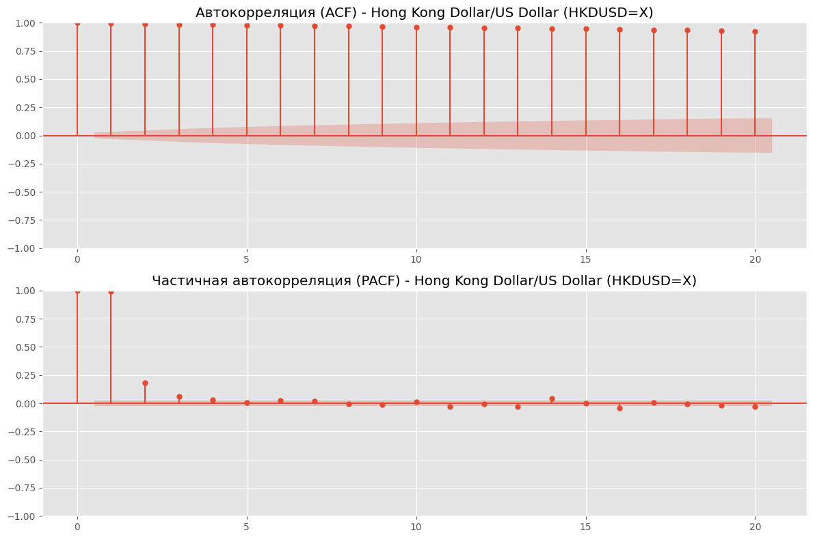

# **Годовой проект: Прогнозирование цен акций**
# **Чекпоинт №2: EDA**

# **Описание задач и целей анализа финансовых временных рядов** #

Анализ временных рядов финансовых активов представляет собой комплексное исследование, направленное на выявление трендов, сезонных закономерностей, волатильности и других важных характеристик рынка. Основной целью данного анализа является построение структурированного понимания поведения цен различных активов, таких как акции, сырьевые товары, индексы, облигации и валюты. В результате этого исследования предполагается получить глубинные выводы, которые можно использовать для прогнозирования и стратегического планирования. **Наш EDA состоит из 18 частей, в разрезе которых приводятся выводы ниже.**

---

## **Задачи анализа включают:** ##

---

- **Сбор и предварительная обработка данных:** 

Загрузка исторических данных для ключевых тикеров, включающих акции, сырьевые товары, индексы, облигации и валюты. На этом этапе производится проверка данных на полноту, частоту, отсутствие выбросов и корректное определение структуры.
Сегментация активов по классам: Для более целенаправленного анализа активы разделяются на категории — акции, сырьевые товары, индексы, облигации и валюты. Такая группировка позволяет учесть специфические характеристики каждого класса активов и проводить более релевантные сравнения.

- **Статистический анализ и вычисление основных метрик:** 

Проведение описательной статистики по каждому активу, чтобы выявить основные статистические показатели (средние значения, медианы, стандартные отклонения и т.д.).
Построение автокорреляционных и частичных автокорреляционных функций для изучения временных зависимостей и влияния предыдущих значений на текущие.

- **Проверка стационарности временных рядов:** 

Проведение тестов на стационарность (например, ADF, KPSS), чтобы определить, подвержены ли временные ряды изменению трендов и сезонности с течением времени. Стационарные ряды позволяют более надежно прогнозировать будущее, поскольку сохраняют стабильную структуру.

- **Выявление выбросов и аномалий:**

Очистка данных от экстремальных значений для предотвращения искажения статистики и аналитики. Обработка выбросов позволяет создать более точные модели и предотвратить влияние единичных событий на общую картину.

- **Декомпозиция временных рядов:** 

Разделение временных рядов на компоненты тренда, сезонности и остатка. Это позволяет выделить долгосрочные тенденции и регулярные циклы, а также понять, какие отклонения вызваны случайными факторами.

- **Корреляционный анализ между активами:**

Определение степени взаимосвязи между различными классами активов для изучения поведения рынка в целом и выявления потенциальных защитных активов.

- **Учет макроэкономических факторов:** 

Исследование взаимосвязи между активами и макроэкономическими показателями (такими как процентные ставки, инфляция и темпы роста экономики) для понимания реакции активов на изменения в экономической среде. Включение макроэкономических данных в мультифакторные модели риска помогает дать более точную оценку влияния внешних условий на поведение активов.

# **Методы анализа временных рядов финансовых активов** #

- **Декомпозиция временных рядов (STL):**

Используется метод Seasonal-Trend decomposition using LOESS (STL) для разложения временного ряда на тренд, сезонные и случайные компоненты. STL позволяет гибко настраивать сезонные и трендовые компоненты, что особенно важно для финансовых данных с переменной сезонностью. Этот метод позволяет изолировать длительные тенденции от циклических колебаний, упрощая интерпретацию основных движущих факторов.

- **Тесты на стационарность (ADF и KPSS):** 

Для проверки стационарности применяются тесты Augmented Dickey-Fuller (ADF) и Kwiatkowski-Phillips-Schmidt-Shin (KPSS). ADF помогает выявить наличие единичного корня, указывающего на нестационарность ряда, тогда как KPSS проверяет гипотезу о стационарности по отношению к тренду. Эти тесты позволяют убедиться, что временной ряд подходит для моделирования, и при необходимости применять корректировки, такие как дифференцирование.

- **Автокорреляционная функция (ACF) и частичная автокорреляционная функция (PACF):** 

ACF и PACF используются для анализа временной зависимости на разных временных лагах. ACF показывает, насколько текущие значения коррелируют с прошлыми, а PACF изолирует прямую зависимость текущего значения от значений на конкретных лагах, исключая влияние промежуточных. Эти функции помогают выбрать подходящие параметры для моделей, таких как ARIMA, что критично для прогнозирования временных рядов с автокорреляцией.

- **Фильтрация выбросов с помощью процентилей:**

Для очистки данных от экстремальных значений используется процентильная фильтрация. Этот метод помогает исключить редкие аномалии, вызванные, например, рыночными шоками, сохраняя при этом ключевые характеристики временного ряда. Процентильная фильтрация позволяет снизить влияние выбросов на статистические показатели и модели, делая данные более стабильными для анализа.

- **Корреляционный анализ (кросс-корреляция):** 

Для оценки взаимосвязей между активами применяется кросс-корреляционный анализ. Этот метод выявляет степень зависимости между временными рядами на разных временных лагах, что позволяет понять, как активы из различных классов (например, акции и облигации) влияют друг на друга и обнаружить взаимосвязи, которые могут использоваться для хеджирования и минимизации риска.

- **Статистические метрики:**

Среднее, медиана, стандартное отклонение и другие базовые статистики дают общую характеристику распределения и волатильности актива. Эти метрики позволяют быстро оценить тенденции и уровень риска, что критично для понимания поведения актива и дальнейшего моделирования.

# **Этапы анализа и основные выводы:** #

## **1. Изучение структуры данных:** ##

 Структура данных и основные колонки:
   - Файл содержит таблицы с информацией о финансовых активах, включая открывающиеся, максимальные, минимальные и закрывающиеся цены, а также объемы торгов.
   - Обязательные колонки, найденные в файле: `Open`, `High`, `Low`, `Close`, `Volume`, `Ticker`, `Full Name`.
   - Все необходимые колонки присутствуют, что позволяет полноценно анализировать данные и строить инвестиционные выводы.

 Типы данных:
   - Колонки `Open`, `High`, `Low`, `Close` представлены как **числовые значения с плавающей точкой (float64)**, что подтверждает корректность формата для анализа цен.
   - Колонка `Volume` представлена как **целочисленные значения (int64)**, что соответствует количеству проданных или купленных акций.
   - Колонки `Ticker` и `Full Name` представлены как **строковые значения**, что позволяет идентифицировать активы и использовать их для группировки.

 Список тикеров и полные названия активов:
   - **AAPL**: Apple Inc.
   - **MSFT**: Microsoft Corporation
   - **NVDA**: NVIDIA Corporation
   - **TSLA**: Tesla Inc.
   - **AMZN**: Amazon.com Inc.
   - **GOOG**: Alphabet Inc.
   - **META**: Meta Platforms, Inc.
   - **JPM**: JPMorgan Chase & Co.
   - **WMT**: Walmart Inc.
   - **NFLX**: Netflix, Inc.
   - **BABA**: Alibaba Group Holding Limited
   - **DIS**: The Walt Disney Company
   - **PFE**: Pfizer Inc.
   - **VZ**: Verizon Communications Inc.
   - **KO**: The Coca-Cola Company
   - **INTC**: Intel Corporation
   - **CSCO**: Cisco Systems, Inc.
   - **ADBE**: Adobe Inc.
   - **CMCSA**: Comcast Corporation
   - **T**: AT&T Inc.
   - **^GSPC**: S&P 500
   - **^DJI**: Dow Jones Industrial Average
   - **^IXIC**: NASDAQ Composite
   - **^RUT**: Russell 2000
   - **^VIX**: Volatility Index
   - **^TNX**: 10-Year Treasury Yield
   - **^IRX**: 13-Week Treasury Bill Yield
   - **^TYX**: 30-Year Treasury Yield
   - **EURUSD=X**: Euro/US Dollar
   - **JPYUSD=X**: Japanese Yen/US Dollar
   - **GBPUSD=X**: British Pound/US Dollar
   - **AUDUSD=X**: Australian Dollar/US Dollar
   - **CADUSD=X**: Canadian Dollar/US Dollar
   - **CHFUSD=X**: Swiss Franc/US Dollar
   - **CNYUSD=X**: Chinese Yuan/US Dollar
   - **SGDUSD=X**: Singapore Dollar/US Dollar
   - **HKDUSD=X**: Hong Kong Dollar/US Dollar

 Проверка структуры типов данных:
   - Проверка показала, что типы данных соответствуют стандартам для финансового анализа. Колонки с ценами и объемами представлены в подходящих числовых форматах.
   - Строковые значения в колонках `Ticker` и `Full Name` также корректны для использования в описаниях и классификации активов.

 Разделение на группы:
   - Данные можно разделить на несколько групп для анализа: 
     - Акции компаний (например, AAPL, TSLA, MSFT).
     - Индексы (например, S&P 500, NASDAQ Composite).
     - Товарные активы и фьючерсы (например, золото, нефть).
     - Валютные пары (например, EUR/USD, JPY/USD).
     - Доходности облигаций (например, ^TNX, ^TYX).
   - Такое разделение позволяет проводить более детальный анализ по категориям активов.

 Результаты проверки:
- Все необходимые колонки присутствуют.
- Типы данных соответствуют ожиданиям и позволяют выполнять дальнейший анализ.
- Данные можно эффективно разделить по группам для углубленного анализа различных типов активов.
На этом этапе проводится начальное изучение загруженных данных по каждому активу, включая проверку структуры колонок, типов данных, частоты данных и наличия пропусков. Это позволяет убедиться в корректности данных перед проведением дальнейшего анализа.

**С более подробной информацией о данных и причинах выбора именно этих показателей можно ознакомиться в файле dataset.md по ссылке https://github.com/apukhaevaa/team74_stock_price_forecasting/blob/main/dataset.md.**

## **2. & 5. Очистка, проверка и подсчет выбросов в разрезе активов: Основные информативные выводы** ##

Для устранения экстремальных значений был применен метод, основанный на 0.1% и 99.9% перцентилях. Этот подход помогает стабилизировать временные ряды и делает их более пригодными для долгосрочного прогнозирования, снижая влияние резких краткосрочных скачков, связанных с рыночными событиями. Удаление выбросов особенно важно для высоковолатильных активов, таких как технологические акции (например, TSLA(Tesla), META), которые подвержены резким колебаниям из-за спекулятивной активности и новостей. Исключение таких экстремальных значений улучшает предсказуемость для моделей, ориентированных на долгосрочные тренды.

 
 Волатильность акций

- Высокая волатильность:

  - MSFT и AAPL демонстрируют высокие средние значения и стандартные отклонения, что указывает на значительные колебания цен. Например, стандартное отклонение AAPL составляет более 52, а MSFT — около 97, что свидетельствует о высокой нестабильности цен этих акций.

  - TSLA и AMZN также показывают высокую волатильность с соответствующими высокими средними значениями и стандартными отклонениями, отражая динамичный характер их рыночных движений.

- Низкая волатильность:

  - Валютные пары, такие как **USD/CNY**, **USD/JPY**, **USD/GBP**, **USD/AUD**, **USD/CAD**, **USD/CHF**, **USD/SGD**, и **USD/HKD**, демонстрируют значительно меньшие стандартные отклонения, что указывает на более стабильные курсовые изменения.

 Объем торгов

- Высокие объемы:

  - **AAPL** имеет средний объем торгов около 3.57e+08, что свидетельствует о высокой ликвидности и большом интересе со стороны инвесторов.

  - **MSFT**, **AMZN**, и **GOOG** также демонстрируют значительные объемы торгов, что делает их привлекательными для активных трейдеров.

- Низкие объемы:

  - Инструменты, такие как индексы **^VIX**, **^TNX**, и валютные пары, например, **USD/CNY**, показывают относительно низкие объемы торгов, что может указывать на узкую инвестиционную базу или специфику самих инструментов.

 Диапазон цен

- Широкий диапазон:

  - **AMZN**, **TSLA**, и **GOOG** имеют значительный диапазон цен от минимума до максимума, что указывает на большие движения цен за период наблюдения.

  - **AAPL** и **MSFT** также демонстрируют широкий диапазон, но в несколько меньших масштабах по сравнению с вышеупомянутыми акциями.

- Узкий диапазон:

  - Валютные пары и некоторые индексы имеют более узкий диапазон цен, что свидетельствует о стабильности их котировок.

 Выбросы и их удаление

- В данных выявлены выбросы для нескольких акций, включая **AAPL**, **MSFT**, **NVDA**, **TSLA**, и **AMZN**. Эти выбросы представляют собой аномальные значения, которые могли возникнуть из-за резких рыночных движений, ошибок в данных или специфических событий, влияющих на акции в определенные даты.

- Для удаления выбросов была применена линейная интерполяция:

  - Для каждой из упомянутых акций проведено удаление выбросов, что позволило очистить данные и обеспечить более точный анализ. После удаления выбросов количество записей уменьшилось, например, для **AAPL** осталось 8760 записей из 8777, для **MSFT** — 8759 из 8777, и так далее.

Количество удаленных выбросов в разрезе активов:

- (AAPL)	Apple Inc. - 17

- (MSFT)	Microsoft Corporation	- 18

- (NVDA)	NVIDIA Corporation	- 12

- (TSLA)	Tesla Inc.	- 8

- (AMZN)	Amazon.com Inc.	- 12

- (GOOG)	Alphabet Inc.	- 12

- (META)	Meta Platforms, Inc. - 8

- (JPM)	JPMorgan Chase & Co.	- 18

- (WMT)	Walmart Inc.	- 17

- (NFLX)	Netflix, Inc.	- 12

- (BABA)	Alibaba Group Holding Limited	- 6

- (DIS)	The Walt Disney Company	- 18

- (PFE)	Pfizer Inc.	- 18

- (VZ)	Verizon Communications Inc.	- 17

- (KO)	The Coca-Cola Company	-16

- (INTC)	Intel Corporation	-17

- (CSCO)	Cisco Systems, Inc.	16

- (ADBE)	Adobe Inc.	- 18

- (CMCSA)	Comcast Corporation	- 18

- (T)	AT&T Inc.	- 17

- (CL=F)	Crude Oil Futures	- 14

- (GC=F)	Gold Futures	- 13

- (SI=F)	Silver Futures	- 14

- (HG=F)	Copper Futures	- 14

- (ZS=F)	Soybean Futures	- 14

- (^GSPC)	S&P 500	- 18

- (^DJI)	Dow Jones Industrial Average	- 18

- (^IXIC)	NASDAQ Composite	- 18

- (^RUT)	Russell 2000	- 18

- (^VIX)	Volatility Index	- 18

- (^TNX)	10-Year Treasury Yield	- 18

- (^IRX)	13-Week Treasury Bill Yield	- 15

- (^TYX)	30-Year Treasury Yield	- 18

- (EURUSD=X)	Euro/US Dollar - 12

- (JPYUSD=X)	Japanese Yen/US Dollar	- 16

- (GBPUSD=X)	British Pound/US Dollar	- 12

- (AUDUSD=X)	Australian Dollar/US Dollar	- 10

- (CADUSD=X)	Canadian Dollar/US Dollar	- 12

- (CHFUSD=X)	Swiss Franc/US Dollar	- 11

- (CNYUSD=X)	Chinese Yuan/US Dollar	- 12

- (SGDUSD=X)	Singapore Dollar/US Dollar	- 12

- (HKDUSD=X)	Hong Kong Dollar/US Dollar -	12

Преимущества удаления выбросов:

    - Повышение точности статистических показателей, таких как среднее и стандартное отклонение.

    - Улучшение качества данных для последующего моделирования, прогнозирования и анализа трендов.

    - Снижение влияния экстремальных значений, которые могут искажать результаты анализа.

 Сравнительный анализ инструментов

- Акции технологических гигантов (например, **AAPL**, **MSFT**, **NVDA**, **AMZN**) демонстрируют высокую среднюю стоимость, высокую волатильность и значительные объемы торгов, что отражает их популярность и важность на рынке.

- Традиционные сектора (например, **WMT**, **KO**, **JPM**) показывают более стабильные показатели с меньшей волатильностью по сравнению с технологическими акциями, что делает их привлекательными для инвесторов, ищущих стабильность.

- Финансовые индексы (**^GSPC**, **^DJI**, **^IXIC**, **^RUT**) обладают большими объемами торгов и высокой волатильностью, что отражает их роль как индикаторов состояния рынка.

- Валютные пары и коммодити (например, **CL=F**, **GC=F**) демонстрируют различную степень волатильности и объемов торгов, что зависит от экономических факторов и глобальных событий.

 Практические импликации для инвесторов и аналитиков

- Высоковолатильные инструменты требуют более тщательного управления рисками и могут предоставлять возможности для краткосрочной торговли, но несут повышенные риски.

- Стабильные инструменты подходят для долгосрочных инвестиций и диверсификации портфеля.

- Удаление выбросов позволяет создать более надежные модели прогнозирования и анализа, снижая вероятность искажения результатов из-за аномальных данных.

- Анализ объемов торгов помогает оценить ликвидность инструмента и его привлекательность для различных категорий инвесторов.

Данные представляют собой богатый источник информации для анализа различных аспектов рыночной динамики акций, индексов и валютных пар. Учет волатильности, объемов торгов и удаление выбросов позволяет получить более точные и надежные выводы, что важно для принятия обоснованных инвестиционных решений и разработки эффективных стратегий торговли. 

Обобщение выводов в табличной форме:

| Параметр                          | Описание                                                                                                                           | Примеры инструментов                   |
|-----------------------------------|-------------------------------------------------------------------------------------------------------------------------------------|----------------------------------------|
| Волатильность акций           | - Высокая волатильность у MSFT, AAPL, TSLA и AMZN, что указывает на значительные колебания цен. - Низкая волатильность у валютных пар, что указывает на стабильность курсов. | Высокая волатильность: MSFT, AAPL, TSLA, AMZN Низкая волатильность: USD/CNY, USD/JPY, USD/GBP |
| Объем торгов                  | - Высокие объемы у AAPL, MSFT, AMZN, указывающие на высокую ликвидность. - Низкие объемы у валютных пар и некоторых индексов, например, ^VIX и ^TNX. | Высокие объемы: AAPL, MSFT, AMZN Низкие объемы: ^VIX, ^TNX, USD/CNY |
| Диапазон цен                  | - Широкий диапазон у AMZN, TSLA, GOOG, что показывает значительные ценовые движения. - Узкий диапазон у валютных пар, указывающий на стабильность. | Широкий диапазон: AMZN, TSLA, GOOG Узкий диапазон: валютные пары |
| Выбросы и их удаление         | - Обнаружены и удалены выбросы для AAPL, MSFT, NVDA, TSLA, AMZN, что улучшает качество анализа и снижает искажение статистики.     | Удаленные выбросы: AAPL, MSFT, NVDA, TSLA, AMZN |
| Сравнительный анализ инструментов | - Технологические компании (AAPL, MSFT, NVDA, AMZN) характеризуются высокой стоимостью и объемом торгов. - Традиционные сектора (WMT, KO, JPM) показывают меньшую волатильность. - Финансовые индексы (^GSPC, ^DJI) обладают высокой волатильностью и большими объемами. | Технологические: AAPL, MSFT, NVDA, AMZN Традиционные: WMT, KO, JPM Финансовые индексы: ^GSPC, ^DJI |
| Практические импликации       | - Высоковолатильные инструменты подходят для краткосрочной торговли, но требуют тщательного управления рисками. - Стабильные инструменты подходят для долгосрочных инвестиций. - Удаление выбросов улучшает надежность анализа и моделей прогнозирования. | Высоковолатильные: TSLA, AMZN Стабильные: валютные пары Удаление выбросов: AAPL, MSFT, NVDA |

## **3. Первичная визуализация:** ##

## **Агрегированные характеристики групп активов** ##

**Акции:**

Разнородность секторов среди акций делает их поведение зависимым от секторальных циклов и макроэкономических условий. Сектор высоких технологий (AAPL, MSFT, NVDA) демонстрирует восходящий тренд, основанный на инновационном потенциале и потребительском спросе, тогда как промышленный сектор (BA, CAT) более подвержен глобальным экономическим циклам и демонстрирует менее стабильную доходность.

**Особый случай:**

TSLA (Tesla), демонстрирующая повышенную волатильность из-за спекулятивных ожиданий, связанных с «зелеными» технологиями и уникальным стратегическим положением на рынке.

**Индексы акций:**

Основные фондовые индексы, такие как S&P 500, отражают общее состояние рыночных настроений и экономической активности. Они демонстрируют устойчивый рост с умеренной цикличностью, показывая меньшую волатильность, чем отдельные акции. Эти индексы надёжно отражают макроэкономическое состояние и фазы экономического цикла.

**Индексы облигаций:**

Облигационные индексы характеризуются низкой волатильностью и устойчивостью, отражая стабильность по сравнению с акциями и сырьевыми товарами. Их общий тренд предсказуем, с минимальными колебаниями, что делает их надёжным показателем в периоды нестабильности.

**С 2010 года доходность облигаций демонстрировала важные макроэкономические тенденции:**

**Длительный период низких ставок:**

Сразу после финансового кризиса 2008 года центральные банки, такие как ФРС США, установили крайне низкие процентные ставки для стимулирования экономики. Это привело к значительному снижению доходности облигаций, особенно долгосрочных, что сохранялось до середины 2010-х годов.

**Рост доходности в 2016–2018 годах:**

В этот период центральные банки начали постепенно повышать ставки в ответ на устойчивый экономический рост и стабилизацию рынков. Это вызвало заметный рост доходности, особенно в долгосрочных облигациях, что свидетельствует о росте ожиданий по инфляции и экономической активности.

**Пандемия COVID-19 и новый спад доходности (2020 год):**

В начале 2020 года на фоне пандемии доходность резко снизилась, особенно в краткосрочных облигациях, так как центральные банки вновь снизили ставки и начали стимулирующие программы. Этот период также характеризовался резким увеличением волатильности на рынке облигаций.

**Последний рост доходности (с 2022 года):**

В ответ на рост инфляции центральные банки снова начали повышать ставки, что привело к росту доходности облигаций. Долгосрочные облигации показали наибольший рост доходности, так как инвесторы пересматривали ожидания по инфляции и ставкам на ближайшие годы.

**Диверсификационные свойства:**

В периоды нестабильности, такие как пандемия, облигации продолжали использоваться как защитный актив, особенно долгосрочные. Их доходность снижалась при кризисах, что делало их важным элементом для диверсификации и снижения рисков в инвестиционных портфелях.

**Сырьевые товары:**

Сырьевые активы характеризуются глобально обусловленными колебаниями. Энергоресурсы, такие как нефть, обладают ярко выраженными циклами, зависящими от спроса и политической стабильности. Драгоценные металлы (золото) имеют тренд, слабо зависящий от экономического цикла, и выступают как «защитный актив» в условиях кризисов.

**Особый случай:**

Золото, стабильно растущее в периоды нестабильности, используемое как инфляционный хедж.

## **Валюты:** ##

**Долгосрочные тренды:**

Для всех валютных пар, таких как EUR/USD, CAD/USD, JPY/USD, GBP/USD и AUD/USD, видны долгосрочные тренды. Например, наблюдается общее укрепление и ослабление различных валют по отношению к доллару США в определённые периоды. Это может быть связано с глобальными экономическими циклами, кризисами и политическими событиями.
Видно, что евро и британский фунт переживали периоды значительного ослабления по отношению к доллару в последние годы, что может указывать на последствия экономической нестабильности в Еврозоне и Великобритании.

**Сезонные колебания:**

Сезонные компоненты на графиках демонстрируют незначительные регулярные колебания, особенно для CAD/USD и JPY/USD. Это может указывать на слабую, но регулярную сезонность, возможно связанную с товарооборотом или влиянием природных ресурсов (например, для CAD/USD это может быть связано с нефтяной индустрией Канады).
Однако, если бы сезонность была высокой, мы бы ожидали более выраженные колебания на графике сезонной составляющей с отчётливыми пиками и впадинами, которые повторялись бы ежегодно. Например, в сельскохозяйственных или туристических данных такие колебания были бы более ярко выражены.

## **4. Сравнительный анализ групп активов** ##

Акции, особенно в технологическом секторе, демонстрируют более устойчивый долгосрочный тренд, движимый внутренними инновациями и стратегическим ростом. В отличие от этого, сырьевые товары цикличны и подвержены резким колебаниям в зависимости от геополитической и экономической ситуации. Валюты, хоть и демонстрируют циклы, имеют более стабильную динамику, которая отражает макроэкономическое состояние стран-эмитентов.

## **6. Визуализация после ресемплирования:** ##

## **Акции:** ##

Технологический сектор: Месячные и квартальные интервалами подтверждают устойчивый тренд и умеренное снижение волатильности, что подчёркивает стабильность роста.

## **Индексы акций:** ##

Фондовые индексы (например, S&P 500) показывают устойчивый долгосрочный тренд и уменьшение волатильности на месячных и квартальных интервалах, подтверждая их роль как общего индикатора экономической стабильности.

## **Сырьевые товары:** ##

Нефть: Квартальные и полугодовые интервалы сохраняют высокую волатильность, отражающую чувствительность к глобальным факторам.
Золото: Годовое ресемплирование подтверждает его стабильность и низкую подверженность колебаниям, выделяя его как долгосрочный актив.

## **Облигации:** ##
10-Year Treasury Yield: 

Годовое ресемплирование выявляет долгосрочные циклы, отражающие реакции на экономические кризисы и изменения в монетарной политике.

13-Week Treasury Bill Yield: 

Краткосрочные циклы, особенно видимые на квартальных и полугодовых графиках, подчеркивают высокую чувствительность к инфляционным ожиданиям и решениям ФРС.

30-Year Treasury Yield: 

Долгосрочная стабильность и плавное снижение тренда на годовом графике указывают на консервативное восприятие этого инструмента инвесторами в периоды высокой неопределенности.

## **Валюты** ##

Валютные пары показывают как долгосрочные тренды, так и сезонные колебания, заметные на уровнях недель, месяцев и кварталов. Например, евро и британский фунт демонстрируют четкий нисходящий тренд после кризиса 2008 года, тогда как японская иена и швейцарский франк проявляют более устойчивую динамику, с временными укреплениями в периоды экономической нестабильности. Канадский и австралийский доллары, как сырьевые валюты, чувствительны к колебаниям цен на нефть и другие ресурсы, что отражается в их волатильности на всех временных интервалах.

# **Тесты временных рядов (ADF)** #

При анализе временных рядов для различных активов был проведён тест  Дикки-Фуллера (ADF), целью которого является определение стационарности данных. Результаты показали, что большинство временных рядов не являются стационарными: значения p-value для большинства активов превышают пороговое значение 0.05, что указывает на присутствие трендов или других нестационарных характеристик.

Всего два актива, такие как Hong Kong Dollar/US Dollar (HKDUSD=X) и индекс волатильности (^VIX), проявили признаки стационарности, что свидетельствует о том, что их данные могут быть использованы для моделирования без дополнительных преобразований. Однако для большинства активов требуется применение методов предобработки, таких как дифференцирование или логарифмирование, чтобы устранить нестационарные компоненты и улучшить качество данных для дальнейшего анализа. 

# **Исследование автокорреляционной структуры временных рядов** #

**Присутствие нестационарности:** 

Во всех графиках ACF не наблюдаются высокие значения автокорреляции на множестве лагов, что указывает на отсутствие автокорреляции данных. Всего два актива, такие как Hong Kong Dollar/US Dollar (HKDUSD=X) и индекс волатильности (^VIX), проявили признаки наличия автокорреляции, что свидетельствует о том, что их данные не могут быть использованы для моделирования без дополнительных преобразований (см. изображения ниже). 

**Наличие тренда:**

На графиках PACF видно, что автокорреляция быстро затухает после первых нескольких лагов, что указывает на сильное влияние тренда. Для большинства активов PACF показывает значимые пики только на первых 1-2 лагах, что типично для временных рядов с трендом, но без ярко выраженной сезонности.

**Необходимость трансформаций:** 

Для того чтобы использовать данные для временных моделей, необходимо провести предварительные преобразования, такие как дифференцирование, чтобы устранить тренд и добиться стационарности. Это позволит снизить автокорреляцию на больших лагах и сделать данные более подходящими для моделирования.

## **10. Устранение нестационарности, автокорреляции и сезонности** ##

**Логарифмирование:** Это преобразование позволяет уменьшить экспоненциальные тренды и стабилизировать дисперсию, особенно если временные ряды имеют экспоненциальный рост или падение. В результате логарифмирования данные становятся более подходящими для дальнейшего анализа, так как уровень автокорреляции снижается, особенно на больших лагах (см. пример ниже).

**Результат логарифмирования:**

Автокорреляция (ACF): На графиках ACF по-прежнему видны высокие значения автокорреляции на многих лагах для двух активов, что свидетельствует о сохранении долговременных зависимостей в данных даже после логарифмирования. Это означает, что логарифмирование данных помогло частично стабилизировать дисперсию, но не устранило тренд или цикличность полностью. Автокорреляция на длинных лагах всё ещё указывает на наличие трендовой компоненты.
Частичная автокорреляция (PACF): Графики PACF показывают высокие пики на первых 1-2 лагах, после чего значения резко уменьшаются и остаются в пределах доверительного интервала. Это указывает на то, что данные содержат тренд, который влияет на начальные лаги, но он не имеет сильного влияния на более дальние лаги. Это типичный признак того, что ряд ещё нуждается в дифференцировании для достижения стационарности.
Эффективность логарифмирования: Логарифмирование помогло частично стабилизировать временные ряды, сделав дисперсию более постоянной, но не устранило тренд полностью. Таким образом, логарифмирование оказалось полезным, но недостаточным для достижения полной стационарности данных.

**Применение дифференцирования к ряду**

Для достижения полной стационарности временных рядов было применено дифференцирование, что позволило устранить оставшиеся тренды и автокорреляционные зависимости. Дифференцирование является стандартной техникой в анализе временных рядов, которая помогает убрать долговременные тренды и сделать данные более устойчивыми.

Первое дифференцирование: Основной метод, применённый к временным рядам, — это первое дифференцирование, при котором от каждого значения ряда отнимается предыдущее значение. Это помогло значительно снизить автокорреляцию на больших лагах, что подтверждается обновлёнными графиками ACF и PACF, где автокорреляционные значения уменьшились и попали в доверительный интервал на более длинных лагах.

Достижение стационарности: После первого дифференцирования временные ряды стали ближе к стационарным, что также подтвердилось с помощью повторного теста Дикки-Фуллера (ADF). Значения p-value после дифференцирования стали ниже порогового уровня (обычно 0.05), что указывает на отсутствие тренда и наличие стационарных свойств.

Устранение остаточной автокорреляции: Дифференцирование позволило устранить остаточную автокорреляцию, что делает временные ряды более пригодными для моделирования с использованием стационарных моделей, таких как ARIMA (см. пример ниже).

## **11. & 12. Анализ влияния и поквартальный ресемплинг** ##

**Импорт данных с помощью fred api. Macrodata**

Макроэкономические данные импортированны из базы данных FRED (Federal Reserve Economic Data) по следующим показателям: ВВП, уровень безработицы, индекс потребительских цен (CPI), индекс промышленного производства (PMI), процентная ставка, торговый баланс, экспорт и импорт. Данные представлены с 1990 года до текущей даты, после чего объединяются в один `DataFrame` `macro_data` для анализа.

**С более подробной информацией о данных и причинах выбора именно этих показателей можно ознакомиться в файле dataset.md по ссылке https://github.com/apukhaevaa/team74_stock_price_forecasting/blob/main/dataset.md.**

Ключевые макроэкономические показатели (ВВП, безработица, CPI, PMI, процентные ставки, торговый баланс, экспорт, импорт), агрегируются по кварталам для сглаживания данных. В связи с этим, был произведен ресемплинг данных по всем активам для того, чтобы в последствии выполнить шаги по анализу влияния, а именно: анализ корреляции и регрессии для выявления показателей влияния макроданных на активы.

