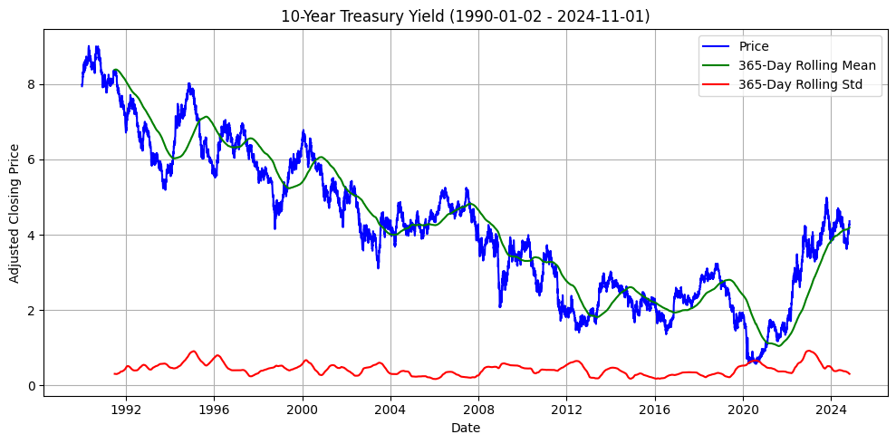

# **Годовой проект: Прогнозирование цен акций**
# **Чекпоинт №2: EDA**

Ссылка на ноутбук: https://github.com/apukhaevaa/team74_stock_price_forecasting/blob/main/initial/2_checkpoint.ipynb

# **Описание задач и целей анализа финансовых временных рядов** #

Анализ временных рядов финансовых активов представляет собой комплексное исследование, направленное на выявление трендов, сезонных закономерностей, волатильности и других важных характеристик рынка. Основной целью данного анализа является построение структурированного понимания поведения цен различных активов, таких как акции, сырьевые товары, индексы, облигации и валюты. В результате этого исследования предполагается получить глубинные выводы, которые можно использовать для прогнозирования и стратегического планирования. **EDA состоит из 18 частей, в разрезе которых приводятся выводы ниже.**

---

## **Задачи анализа включают:** ##

---

- **Сбор и предварительная обработка данных:** 

Загрузка исторических данных для ключевых тикеров, включающих акции, сырьевые товары, индексы, облигации и валюты. На этом этапе производится проверка данных на полноту, частоту, отсутствие выбросов и корректное определение структуры.
Сегментация активов по классам: Для более целенаправленного анализа активы разделяются на категории — акции, сырьевые товары, индексы, облигации и валюты. Такая группировка позволяет учесть специфические характеристики каждого класса активов и проводить более релевантные сравнения.

- **Статистический анализ и вычисление основных метрик:** 

Проведение описательной статистики по каждому активу, чтобы выявить основные статистические показатели (средние значения, медианы, стандартные отклонения и т.д.).
Построение автокорреляционных и частичных автокорреляционных функций для изучения временных зависимостей и влияния предыдущих значений на текущие.

- **Проверка стационарности временных рядов:** 

Проведение тестов на стационарность (например, ADF, KPSS), чтобы определить, подвержены ли временные ряды изменению трендов и сезонности с течением времени. Стационарные ряды позволяют более надежно прогнозировать будущее, поскольку сохраняют стабильную структуру.

- **Выявление выбросов и аномалий:**

Очистка данных от экстремальных значений для предотвращения искажения статистики и аналитики. Обработка выбросов позволяет создать более точные модели и предотвратить влияние единичных событий на общую картину.

- **Декомпозиция временных рядов:** 

Разделение временных рядов на компоненты тренда, сезонности и остатка. Это позволяет выделить долгосрочные тенденции и регулярные циклы, а также понять, какие отклонения вызваны случайными факторами.

- **Корреляционный анализ между активами:**

Определение степени взаимосвязи между различными классами активов для изучения поведения рынка в целом и выявления потенциальных защитных активов.

- **Учет макроэкономических факторов:** 

Исследование взаимосвязи между активами и макроэкономическими показателями (такими как процентные ставки, инфляция и темпы роста экономики) для понимания реакции активов на изменения в экономической среде. Включение макроэкономических данных в мультифакторные модели риска помогает дать более точную оценку влияния внешних условий на поведение активов.

# **Методы анализа временных рядов финансовых активов** #

- **Декомпозиция временных рядов (STL):**

Используется метод Seasonal-Trend decomposition using LOESS (STL) для разложения временного ряда на тренд, сезонные и случайные компоненты. STL позволяет гибко настраивать сезонные и трендовые компоненты, что особенно важно для финансовых данных с переменной сезонностью. Этот метод позволяет изолировать длительные тенденции от циклических колебаний, упрощая интерпретацию основных движущих факторов.

- **Тесты на стационарность (ADF и KPSS):** 

Для проверки стационарности применяются тесты Augmented Dickey-Fuller (ADF) и Kwiatkowski-Phillips-Schmidt-Shin (KPSS). ADF помогает выявить наличие единичного корня, указывающего на нестационарность ряда, тогда как KPSS проверяет гипотезу о стационарности по отношению к тренду. Эти тесты позволяют убедиться, что временной ряд подходит для моделирования, и при необходимости применять корректировки, такие как дифференцирование.

- **Автокорреляционная функция (ACF) и частичная автокорреляционная функция (PACF):** 

ACF и PACF используются для анализа временной зависимости на разных временных лагах. ACF показывает, насколько текущие значения коррелируют с прошлыми, а PACF изолирует прямую зависимость текущего значения от значений на конкретных лагах, исключая влияние промежуточных. Эти функции помогают выбрать подходящие параметры для моделей, таких как ARIMA, что критично для прогнозирования временных рядов с автокорреляцией.

- **Фильтрация выбросов с помощью процентилей:**

Для очистки данных от экстремальных значений используется процентильная фильтрация. Этот метод помогает исключить редкие аномалии, вызванные, например, рыночными шоками, сохраняя при этом ключевые характеристики временного ряда. Процентильная фильтрация позволяет снизить влияние выбросов на статистические показатели и модели, делая данные более стабильными для анализа.

- **Корреляционный анализ (кросс-корреляция):** 

Для оценки взаимосвязей между активами применяется кросс-корреляционный анализ. Этот метод выявляет степень зависимости между временными рядами на разных временных лагах, что позволяет понять, как активы из различных классов (например, акции и облигации) влияют друг на друга и обнаружить взаимосвязи, которые могут использоваться для хеджирования и минимизации риска.

- **Статистические метрики:**

Среднее, медиана, стандартное отклонение и другие базовые статистики дают общую характеристику распределения и волатильности актива. Эти метрики позволяют быстро оценить тенденции и уровень риска, что критично для понимания поведения актива и дальнейшего моделирования.

# **Этапы анализа и основные выводы:** #

## **Изучение структуры данных:** ##

 Структура данных и основные колонки:
   - Файл содержит таблицы с данными о финансовых активах, включая цены открытия, максимальные и минимальные цены, цены закрытия, а также объемы торгов.
   - Обязательные колонки, найденные в файле: `Open`, `High`, `Low`, `Close`, `Volume`, `Ticker`, `Full Name`.
   - Все необходимые колонки присутствуют, что позволяет полноценно анализировать данные и строить инвестиционные выводы.

**Сэмпл таблицы**

|   Open |   High |   Low  |   Close |   Volume | Ticker | Full Name       |
|--------|--------|--------|---------|----------|--------|-----------------|
|  4.95  |  4.95  | 4.895  |   4.93  |     2319 | SI=F   | Silver Futures  |
|  4.92  |  5.045 | 4.92   |   5.003 |     1612 | SI=F   | Silver Futures  |
|  5.035 |  5.035 | 4.985  |   5.004 |     1375 | SI=F   | Silver Futures  |
|  4.99  |  5.005 | 4.975  |   4.998 |      856 | SI=F   | Silver Futures  |
|  5     |  5     | 4.98   |   4.983 |      232 | SI=F   | Silver Futures  |

 Типы данных:
   - Колонки `Open`, `High`, `Low`, `Close` представлены как **числовые значения с плавающей точкой (float64)**, что подтверждает корректность формата для анализа цен.
   - Колонка `Volume` представлена как **целочисленные значения (int64)**, что соответствует количеству проданных или купленных акций.
   - Колонки `Ticker` и `Full Name` представлены как **строковые значения**, что позволяет идентифицировать активы и использовать их для группировки.

 Список тикеров и полные названия активов:
   - **AAPL**: Apple Inc.
   - **MSFT**: Microsoft Corporation
   - **NVDA**: NVIDIA Corporation
   - **TSLA**: Tesla Inc.
   - **AMZN**: Amazon.com Inc.
   - **GOOG**: Alphabet Inc.
   - **META**: Meta Platforms, Inc.
   - **JPM**: JPMorgan Chase & Co.
   - **WMT**: Walmart Inc.
   - **NFLX**: Netflix, Inc.
   - **BABA**: Alibaba Group Holding Limited
   - **DIS**: The Walt Disney Company
   - **PFE**: Pfizer Inc.
   - **VZ**: Verizon Communications Inc.
   - **KO**: The Coca-Cola Company
   - **INTC**: Intel Corporation
   - **CSCO**: Cisco Systems, Inc.
   - **ADBE**: Adobe Inc.
   - **CMCSA**: Comcast Corporation
   - **T**: AT&T Inc.
   - **^GSPC**: S&P 500
   - **^DJI**: Dow Jones Industrial Average
   - **^IXIC**: NASDAQ Composite
   - **^RUT**: Russell 2000
   - **^VIX**: Volatility Index
   - **^TNX**: 10-Year Treasury Yield
   - **^IRX**: 13-Week Treasury Bill Yield
   - **^TYX**: 30-Year Treasury Yield
   - **EURUSD=X**: Euro/US Dollar
   - **JPYUSD=X**: Japanese Yen/US Dollar
   - **GBPUSD=X**: British Pound/US Dollar
   - **AUDUSD=X**: Australian Dollar/US Dollar
   - **CADUSD=X**: Canadian Dollar/US Dollar
   - **CHFUSD=X**: Swiss Franc/US Dollar
   - **CNYUSD=X**: Chinese Yuan/US Dollar
   - **SGDUSD=X**: Singapore Dollar/US Dollar
   - **HKDUSD=X**: Hong Kong Dollar/US Dollar

 Проверка структуры типов данных:
   - Проверка показала, что типы данных соответствуют стандартам для финансового анализа. Колонки с ценами и объемами представлены в подходящих числовых форматах.
   - Строковые значения в колонках `Ticker` и `Full Name` также корректны для использования в описаниях и классификации активов.

 Разделение на группы:
   - Данные можно разделить на несколько групп для анализа: 
     - Акции компаний (например, AAPL, TSLA, MSFT).
     - Индексы (например, S&P 500, NASDAQ Composite).
     - Товарные активы и фьючерсы (например, золото, нефть).
     - Валютные пары (например, EUR/USD, JPY/USD).
     - Доходности облигаций (например, ^TNX, ^TYX).
   - Такое разделение позволяет проводить более детальный анализ по категориям активов.

 Результаты проверки:
- Все необходимые колонки присутствуют.
- Типы данных соответствуют ожиданиям и позволяют выполнять дальнейший анализ.
- Данные можно эффективно разделить по группам для углубленного анализа различных типов активов.
На этом этапе проводится начальное изучение загруженных данных по каждому активу, включая проверку структуры колонок, типов данных, частоты данных и наличия пропусков. Это позволяет убедиться в корректности данных перед проведением дальнейшего анализа.

**С более подробной информацией о данных и причинах выбора именно этих показателей можно ознакомиться в файле dataset.md по ссылке https://github.com/apukhaevaa/team74_stock_price_forecasting/blob/main/dataset.md.**

## **Очистка, проверка и подсчет выбросов в разрезе активов; описательная статистика** ##

Для устранения экстремальных значений был применен метод, основанный на 0.1% и 99.9% перцентилях. Этот подход помогает стабилизировать временные ряды и делает их более пригодными для долгосрочного прогнозирования, снижая влияние резких краткосрочных скачков, связанных с рыночными событиями. Удаление выбросов особенно важно для высоковолатильных активов, таких как технологические акции (например, TSLA(Tesla), META), которые подвержены резким колебаниям из-за спекулятивной активности и новостей. Исключение таких экстремальных значений улучшает предсказуемость для моделей, ориентированных на долгосрочные тренды.

**Количество удаленных выбросов в разрезе активов:**

- (AAPL)	Apple Inc. - 17

- (MSFT)	Microsoft Corporation	- 18

- (NVDA)	NVIDIA Corporation	- 12

- (TSLA)	Tesla Inc.	- 8

- (AMZN)	Amazon.com Inc.	- 12

- (GOOG)	Alphabet Inc.	- 12

- (META)	Meta Platforms, Inc. - 8

- (JPM)	JPMorgan Chase & Co.	- 18

- (WMT)	Walmart Inc.	- 17

- (NFLX)	Netflix, Inc.	- 12

- (BABA)	Alibaba Group Holding Limited	- 6

- (DIS)	The Walt Disney Company	- 18

- (PFE)	Pfizer Inc.	- 18

- (VZ)	Verizon Communications Inc.	- 17

- (KO)	The Coca-Cola Company	-16

- (INTC)	Intel Corporation	-17

- (CSCO)	Cisco Systems, Inc.	16

- (ADBE)	Adobe Inc.	- 18

- (CMCSA)	Comcast Corporation	- 18

- (T)	AT&T Inc.	- 17

- (CL=F)	Crude Oil Futures	- 14

- (GC=F)	Gold Futures	- 13

- (SI=F)	Silver Futures	- 14

- (HG=F)	Copper Futures	- 14

- (ZS=F)	Soybean Futures	- 14

- (^GSPC)	S&P 500	- 18

- (^DJI)	Dow Jones Industrial Average	- 18

- (^IXIC)	NASDAQ Composite	- 18

- (^RUT)	Russell 2000	- 18

- (^VIX)	Volatility Index	- 18

- (^TNX)	10-Year Treasury Yield	- 18

- (^IRX)	13-Week Treasury Bill Yield	- 15

- (^TYX)	30-Year Treasury Yield	- 18

- (EURUSD=X)	Euro/US Dollar - 12

- (JPYUSD=X)	Japanese Yen/US Dollar	- 16

- (GBPUSD=X)	British Pound/US Dollar	- 12

- (AUDUSD=X)	Australian Dollar/US Dollar	- 10

- (CADUSD=X)	Canadian Dollar/US Dollar	- 12

- (CHFUSD=X)	Swiss Franc/US Dollar	- 11

- (CNYUSD=X)	Chinese Yuan/US Dollar	- 12

- (SGDUSD=X)	Singapore Dollar/US Dollar	- 12

- (HKDUSD=X)	Hong Kong Dollar/US Dollar -	12

## **Описательная статистика после очистки выбросов** ##

**Сэмпл описательной статистики**

| Тикер | Название                  | Интервал | Медиана (абс.) | Дисперсия (абс.) | Стандартное отклонение (абс.) | Волатильность (%) |
|-------|----------------------------|----------|----------------|-------------------|-------------------------------|--------------------|
| AAPL  | Apple Inc.                 | День     | 2.759323       | 2.745521e+03      | 52.397721                      | 250.647619        |
| MSFT  | Microsoft Corporation      | День     | 20.543489      | 9.575388e+03      | 97.853913                      | 185.748544        |
| NVDA  | NVIDIA Corporation         | День     | 0.431317       | 3.930197e+02      | 19.824725                      | 304.679827        |
| TSLA  | Tesla Inc.                 | День     | 17.742001      | 1.068763e+04      | 103.381008                     | 215.494650        |
| AMZN  | Amazon.com Inc.            | День     | 8.862250       | 3.048246e+03      | 55.210924                      | 293.208343        |
| GOOG  | Alphabet Inc.              | День     | 27.274950      | 2.028012e+03      | 45.033453                      | 137.103909        |
| META  | Meta Platforms, Inc.       | День     | 163.717072     | 1.490818e+04      | 122.099052                     | 140.753603        |
| JPM   | JPMorgan Chase & Co.       | День     | 25.882008      | 2.043978e+03      | 45.210375                      | 216.420408        |

 
**Технологические акции:** Высокая дневная волатильность акций, таких как AAPL, MSFT, NVDA и TSLA, указывает на чувствительность к изменениям в секторе и ожиданиям инвесторов. Эти компании зависят от быстрого роста и инноваций, что делает их акции более подверженными резким изменениям цены в ответ на новостные или финансовые события. Волатильность здесь объясняется как высоким интересом инвесторов, так и рисками, связанными с быстрыми технологическими изменениями.

**Традиционные сектора:** Акции компаний, таких как WMT, KO и JPM, демонстрируют более низкую дневную волатильность благодаря устойчивому спросу на их продукцию и услуги. Эти компании, ориентированные на потребительские товары и финансовые услуги, зависят от стабильного спроса, что делает их менее чувствительными к краткосрочным колебаниям рынка. Стабильность в этих секторах привлекает более консервативных инвесторов, что также снижает волатильность.

**Индексы:** S&P 500 и Dow Jones обладают умеренной дневной волатильностью благодаря диверсификации. Dow Jones демонстрирует большее абсолютное стандартное отклонение, вероятно, из-за меньшего числа компаний в индексе. Это делает его более чувствительным к колебаниям отдельных акций, тогда как более широкий состав S&P 500 сглаживает колебания за счет включения большего числа компаний из разных секторов. Таким образом, структура индекса напрямую влияет на его волатильность.

**Сырьевые товары:** Нефть (CL=F) показывает более высокую дневную волатильность по сравнению с золотом (GC=F), так как её цена зависит от колебаний спроса и предложения, особенно в условиях нестабильности в мировой экономике. Золото же, напротив, выполняет роль защитного актива, поэтому его волатильность остаётся относительно стабильной. Это различие в волатильности показывает, как тип сырьевого товара и его роль на рынке (производственный ресурс или защитный актив) влияют на чувствительность к колебаниям.

**Облигации:** Краткосрочные облигации демонстрируют более высокую дневную волатильность по сравнению с долгосрочными, что связано с их большей чувствительностью к изменениям в денежно-кредитной политике. Инвесторы быстрее реагируют на краткосрочные экономические изменения, что увеличивает волатильность краткосрочных облигаций, тогда как долгосрочные инструменты более стабильны и менее подвержены краткосрочным колебаниям.

**Валюты:** Cхожий уровень волатильности среди валютных пар в таблице обусловлен стабильностью экономик стран-эмитентов, предсказуемой монетарной политикой, а также высокой ликвидностью.

## **Первичная визуализация:** ##

## **Агрегированные характеристики групп активов** ##

**Акции:**

Разнородность секторов среди акций делает их поведение зависимым от секторальных циклов и макроэкономических условий. Сектор высоких технологий (AAPL, MSFT, NVDA) демонстрирует восходящий тренд, основанный на инновационном потенциале и потребительском спросе, тогда как промышленный сектор (BA, CAT) более подвержен глобальным экономическим циклам и демонстрирует менее стабильную доходность.

**Особый случай:**

TSLA (Tesla), демонстрирующая повышенную волатильность из-за спекулятивных ожиданий, связанных с «зелеными» технологиями и уникальным стратегическим положением на рынке.

**Индексы акций:**

Основные фондовые индексы, такие как S&P 500, отражают общее состояние рыночных настроений и экономической активности. Они демонстрируют устойчивый рост с умеренной цикличностью, показывая меньшую волатильность, чем отдельные акции. Эти индексы надёжно отражают макроэкономическое состояние и фазы экономического цикла.

**Индексы облигаций:**

Облигационные индексы характеризуются низкой волатильностью и устойчивостью, отражая стабильность по сравнению с акциями и сырьевыми товарами. Их общий тренд предсказуем, с минимальными колебаниями, что делает их надёжным показателем в периоды нестабильности.

**С 2010 года доходность облигаций демонстрировала важные макроэкономические тенденции:**

**Длительный период низких ставок:**

Сразу после финансового кризиса 2008 года центральные банки, такие как ФРС США, установили крайне низкие процентные ставки для стимулирования экономики. Это привело к значительному снижению доходности облигаций, особенно долгосрочных, что сохранялось до середины 2010-х годов.

**Рост доходности в 2016–2018 годах:**

В этот период центральные банки начали постепенно повышать ставки в ответ на устойчивый экономический рост и стабилизацию рынков. Это вызвало заметный рост доходности, особенно в долгосрочных облигациях, что свидетельствует о росте ожиданий по инфляции и экономической активности.

**Пандемия COVID-19 и новый спад доходности (2020 год):**

В начале 2020 года на фоне пандемии доходность резко снизилась, особенно в краткосрочных облигациях, так как центральные банки вновь снизили ставки и начали стимулирующие программы. Этот период также характеризовался резким увеличением волатильности на рынке облигаций.

**Последний рост доходности (с 2022 года):**

В ответ на рост инфляции центральные банки снова начали повышать ставки, что привело к росту доходности облигаций. Долгосрочные облигации показали наибольший рост доходности, так как инвесторы пересматривали ожидания по инфляции и ставкам на ближайшие годы.

**Диверсификационные свойства:**

В периоды нестабильности, такие как пандемия, облигации продолжали использоваться как защитный актив, особенно долгосрочные. Их доходность снижалась при кризисах, что делало их важным элементом для диверсификации и снижения рисков в инвестиционных портфелях.

**Сырьевые товары:**

Сырьевые активы характеризуются глобально обусловленными колебаниями. Энергоресурсы, такие как нефть, обладают ярко выраженными циклами, зависящими от спроса и политической стабильности. Драгоценные металлы (золото) имеют тренд, слабо зависящий от экономического цикла, и выступают как «защитный актив» в условиях кризисов.

**Особый случай:**

Золото, стабильно растущее в периоды нестабильности, используемое как инфляционный хедж.

## **Валюты:** ##

**Долгосрочные тренды:**

Для всех валютных пар, таких как EUR/USD, CAD/USD, JPY/USD, GBP/USD и AUD/USD, видны долгосрочные тренды. Например, наблюдается общее укрепление и ослабление различных валют по отношению к доллару США в определённые периоды. Это может быть связано с глобальными экономическими циклами, кризисами и политическими событиями.
Видно, что евро и британский фунт переживали периоды значительного ослабления по отношению к доллару в последние годы, что может указывать на последствия экономической нестабильности в Еврозоне и Великобритании.

**Сезонные колебания:**

Сезонные компоненты на графиках демонстрируют незначительные регулярные колебания, особенно для CAD/USD и JPY/USD. Это может указывать на слабую, но регулярную сезонность, возможно связанную с товарооборотом или влиянием природных ресурсов (например, для CAD/USD это может быть связано с нефтяной индустрией Канады).
Однако, если бы сезонность была высокой, мы бы ожидали более выраженные колебания на графике сезонной составляющей с отчётливыми пиками и впадинами, которые повторялись бы ежегодно. Например, в сельскохозяйственных или туристических данных такие колебания были бы более ярко выражены.

## **Сравнительный анализ групп активов** ##

Акции, особенно в технологическом секторе, демонстрируют более устойчивый долгосрочный тренд, движимый внутренними инновациями и стратегическим ростом. В отличие от этого, сырьевые товары цикличны и подвержены резким колебаниям в зависимости от геополитической и экономической ситуации. Валюты, хоть и демонстрируют циклы, имеют более стабильную динамику, которая отражает макроэкономическое состояние стран-эмитентов.

## **Визуализация после ресемплирования:** ##

## **Акции:** ##

Технологический сектор: Месячные и квартальные интервалами подтверждают устойчивый тренд и умеренное снижение волатильности, что подчёркивает стабильность роста.

## **Индексы акций:** ##

Фондовые индексы (например, S&P 500) показывают устойчивый долгосрочный тренд и уменьшение волатильности на месячных и квартальных интервалах, подтверждая их роль как общего индикатора экономической стабильности.

## **Сырьевые товары:** ##

Нефть: Квартальные и полугодовые интервалы сохраняют высокую волатильность, отражающую чувствительность к глобальным факторам.
Золото: Годовое ресемплирование подтверждает его стабильность и низкую подверженность колебаниям, выделяя его как долгосрочный актив.

## **Облигации:** ##
10-Year Treasury Yield: 

Годовое ресемплирование выявляет долгосрочные циклы, отражающие реакции на экономические кризисы и изменения в монетарной политике.

13-Week Treasury Bill Yield: 

Краткосрочные циклы, особенно видимые на квартальных и полугодовых графиках, подчеркивают высокую чувствительность к инфляционным ожиданиям и решениям ФРС.

30-Year Treasury Yield: 

Долгосрочная стабильность и плавное снижение тренда на годовом графике указывают на консервативное восприятие этого инструмента инвесторами в периоды высокой неопределенности.

## **Валюты** ##

Валютные пары показывают как долгосрочные тренды, так и сезонные колебания, заметные на уровнях недель, месяцев и кварталов. Например, евро и британский фунт демонстрируют четкий нисходящий тренд после кризиса 2008 года, тогда как японская иена и швейцарский франк проявляют более устойчивую динамику, с временными укреплениями в периоды экономической нестабильности. Канадский и австралийский доллары, как сырьевые валюты, чувствительны к колебаниям цен на нефть и другие ресурсы, что отражается в их волатильности на всех временных интервалах.

## **Тепловые карты** ##

**Корреляционная матрица - день**

Высокая корреляция между американскими технологическими гигантами: Компании, такие как Apple (AAPL), Microsoft (MSFT), NVIDIA (NVDA), и Amazon (AMZN), имеют высокую взаимную корреляцию. Это объясняется их схожей реакцией на краткосрочные рыночные колебания и новости, которые влияют на сектор высоких технологий в целом.

Низкая корреляция с валютами: Валютные пары, особенно относящиеся к экзотическим валютам, имеют минимальную корреляцию с фондовыми активами. Это свидетельствует о том, что на дневном уровне валютные пары не зависят от краткосрочных движений фондового рынка.

Роль сырьевых товаров: Сырьевые активы, такие как нефть (CL=F) и золото (GC=F), также показывают низкую корреляцию с большинством акций. Однако нефть демонстрирует некоторую положительную корреляцию с энергетическими и промышленными акциями, что указывает на влияние краткосрочных колебаний цен на эти секторы.

Высокая взаимосвязь индексов: Основные фондовые индексы, такие как S&P 500 (^GSPC) и NASDAQ (^IXIC), демонстрируют высокую корреляцию между собой, что объясняется их взаимозависимостью и значением для американской экономики.

Индикаторы волатильности (VIX) и их реакция на рынок: Индекс VIX показывает отрицательную корреляцию с большинством фондовых активов, что свидетельствует о его использовании как индикатора риска в краткосрочной перспективе. Инвесторы, вероятно, хеджируют портфели при росте волатильности.

# **Тесты временных рядов (ADF)** #

При анализе временных рядов для различных активов был проведён тест  Дикки-Фуллера (ADF), целью которого является определение стационарности данных. Результаты показали, что большинство временных рядов не являются стационарными: значения p-value для большинства активов превышают пороговое значение 0.05, что указывает на присутствие трендов или других нестационарных характеристик.

Всего два актива, такие как Hong Kong Dollar/US Dollar (HKDUSD=X) и индекс волатильности (^VIX), проявили признаки стационарности, что свидетельствует о том, что их данные могут быть использованы для моделирования без дополнительных преобразований. Однако для большинства активов требуется применение методов предобработки, таких как дифференцирование или логарифмирование, чтобы устранить нестационарные компоненты и улучшить качество данных для дальнейшего анализа. 

# **Исследование автокорреляционной структуры временных рядов** #

На основе предоставленных графиков ACF и PACF для различных активов можно сделать следующие агрегированные выводы:

1. Присутствие автокорреляции

	•	На графиках ACF для большинства активов наблюдается высокий уровень автокорреляции на всех лагах, особенно на первых лагах. Это говорит о сильной зависимости значений временного ряда от предыдущих наблюдений.
	•	Постоянная автокорреляция на всех лагах ACF указывает на нестационарность данных, что типично для временных рядов, содержащих тренд или сезонность.

2. Структура зависимости (AR и MA компоненты)

	•	На графиках PACF виден значительный пик на первых лагах (обычно на первом или первых двух), а затем значения резко снижаются. Это может указывать на авторегрессионную структуру AR(1) или AR(2), где текущие значения временного ряда зависят в основном от одного или двух предыдущих значений.
	•	Такая структура часто требует применения авторегрессионных моделей для корректного описания зависимости, например, моделей ARIMA с компонентой AR.

3. Рекомендации для преобработки данных

	•	Поскольку данные демонстрируют признаки нестационарности, рекомендуется применять преобразования, такие как взятие первой разности, для приведения данных к стационарному состоянию. Это может устранить тренд и стабилизировать дисперсию.
	

4. Потенциальные модели для анализа

	•	Учитывая наблюдаемые закономерности, подходящими моделями могут быть ARIMA или SARIMA (если есть сезонные компоненты), которые могут эффективно справиться с трендом и автокорреляцией.

## **Устранение нестационарности, автокорреляции и сезонности** ##

**Логарифмирование:** Это преобразование позволяет уменьшить экспоненциальные тренды и стабилизировать дисперсию, особенно если временные ряды имеют экспоненциальный рост или падение. В результате логарифмирования данные становятся более подходящими для дальнейшего анализа, так как уровень автокорреляции снижается, особенно на больших лагах (см. пример ниже).

**Результат логарифмирования:**

Автокорреляция (ACF): На графиках ACF по-прежнему видны высокие значения автокорреляции на многих лагах для  активов, что свидетельствует о сохранении долговременных зависимостей в данных даже после логарифмирования. Это означает, что логарифмирование данных помогло частично стабилизировать дисперсию, но не устранило тренд или цикличность полностью. Автокорреляция на длинных лагах всё ещё указывает на наличие трендовой компоненты.
Частичная автокорреляция (PACF): Графики PACF показывают высокие пики на первых 1-2 лагах, после чего значения резко уменьшаются и остаются в пределах доверительного интервала. Это указывает на то, что данные содержат тренд, который влияет на начальные лаги, но он не имеет сильного влияния на более дальние лаги. Это типичный признак того, что ряд ещё нуждается в дифференцировании для достижения стационарности.
Эффективность логарифмирования: Логарифмирование помогло частично стабилизировать временные ряды, сделав дисперсию более постоянной, но не устранило тренд полностью. Таким образом, логарифмирование оказалось полезным, но недостаточным для достижения полной стационарности данных.

**Применение дифференцирования к ряду**

Для достижения полной стационарности временных рядов было применено дифференцирование, что позволило устранить оставшиеся тренды и автокорреляционные зависимости. Дифференцирование является стандартной техникой в анализе временных рядов, которая помогает убрать долговременные тренды и сделать данные более устойчивыми.

Первое дифференцирование: Основной метод, применённый к временным рядам, — это первое дифференцирование, при котором от каждого значения ряда отнимается предыдущее значение. Это помогло значительно снизить автокорреляцию на больших лагах, что подтверждается обновлёнными графиками ACF и PACF, где автокорреляционные значения уменьшились и попали в доверительный интервал на более длинных лагах.

Достижение стационарности: После первого дифференцирования временные ряды полностью стали стационарными, что также подтвердилось с помощью повторного теста Дикки-Фуллера (ADF). Значения p-value после дифференцирования стали ниже порогового уровня (обычно 0.05), что указывает на отсутствие тренда и наличие стационарных свойств.

Устранение остаточной автокорреляции: Дифференцирование позволило устранить остаточную автокорреляцию, что делает временные ряды более пригодными для моделирования с использованием стационарных моделей, таких как ARIMA (см. примеры активов ниже).

## **Анализ влияния и поквартальный ресемплинг** ##

**Импорт данных с помощью fred api. Macrodata**

Макроэкономические данные импортированны из базы данных FRED (Federal Reserve Economic Data) по следующим показателям: ВВП, уровень безработицы, индекс потребительских цен (CPI), индекс промышленного производства (PMI), процентная ставка, торговый баланс, экспорт и импорт. Данные представлены с 1990 года до текущей даты, после чего объединяются в один `DataFrame` `macro_data` для анализа.

**С более подробной информацией о данных и причинах выбора именно этих показателей можно ознакомиться в файле dataset.md по ссылке https://github.com/apukhaevaa/team74_stock_price_forecasting/blob/main/dataset.md.**

Ключевые макроэкономические показатели (ВВП, безработица, CPI, PMI, процентные ставки, торговый баланс, экспорт, импорт), агрегируются по кварталам для сглаживания данных. В связи с этим, был произведен ресемплинг данных по всем активам для того, чтобы в последствии выполнить шаги по анализу влияния, а именно: анализ корреляции и регрессии для выявления показателей влияния макроданных на активы.

По графикам выше можно сделать следующие статистические выводы:

GDP (ВВП): ВВП показывает стабильный рост с 1990 года, с резкими провалами в периоды экономических кризисов, таких как 2008 и 2020 годы, что указывает на общую тенденцию к росту экономики.
Unemployment Rate (Уровень безработицы): Уровень безработицы подвержен циклическим колебаниям, с резкими скачками в периоды экономических кризисов (особенно заметен пик в 2020 году), после чего он постепенно снижается.
CPI (Индекс потребительских цен): CPI растет устойчиво на протяжении всего периода, что свидетельствует о долгосрочной инфляции.
PMI (Индекс промышленного производства): PMI показывает положительную динамику до 2000-х годов, после чего наблюдаются колебания. Ярко выраженные падения PMI совпадают с экономическими кризисами (например, в 2008 и 2020 годах), указывая на чувствительность промышленного производства к экономическим условиям.
Interest Rate (Процентные ставки): Процентные ставки колебались, снижаясь до минимальных уровней в 2010-х годах и снова повышаясь в последние годы, что может быть связано с борьбой с инфляцией и мерами поддержки экономики.
Trade Balance (Торговый баланс): Торговый баланс показывает общий нисходящий тренд, что может свидетельствовать о росте дефицита торгового баланса страны.
Export (Экспорт): Экспорт показывает тенденцию к снижению после небольшого роста в 1990-х годах, что может указывать на снижение внешней конкурентоспособности.
Import (Импорт): Импорт стабильно растет с 1990 года, что может указывать на рост внутреннего потребления и зависимости от иностранных товаров.

В целом, графики показывают долгосрочные тенденции в ключевых экономических показателях, а также влияние глобальных экономических кризисов на безработицу, промышленное производство и процентные ставки.

В свою очередь, обработанные и дифференцированные активы (в стационарном состоянии), также были подвержены ресемплингу (см. пример ниже). 

Теперь стало возможным приступить к подготовительному этапу перед началом анализа, а именно:  
- Проверку наличия выбросов используя **Z-оценки** для данных в параметре `macro_data`: значения, которые более чем на 3 стандартных отклонения отличаются от среднего. Значений каких либо выбросов, не найдено.
- Проверку на стационарность, автокорреляцию и сезонность используя тесты ADF и KPSS. Большинство временных рядов (GDP, CPI, PMI, Trade Balance, Export, Import) показывают нестационарность. Уровень безработицы и процентная ставка имеют смешанные результаты, но можно считать их стационарными на основании ADF. Для анализа данных, возможно, потребуется трансформация для достижения стационарности, что является необходимым шагом перед дальнейшим моделированием.
- Корректировка данных используя разностное преобразование для достижения стационарности временных рядов. В результате были получены скорректированные данные, которые позволяют устранить тренды и сезонные колебания, что важно для дальнейшего анализа и моделирования.

**Анализ корреляции и линейной регрессии (OLS)**

Данные по макроданным доступны с 1992-06-30. В связи с этим, с целью анализа влияния и проведения линейной регрессии, мы привели данные по активам и макроданным в единый формат с одинаковым началом временного периода. Помимо синхронизации временных интервалов и ограничения данных общим временным диапазоном, было произведено преобразование данных по активам в общий DataFrame. На основе этого была построена корреляционная матрица в разрезе активов и макроданных.

На основе данной матрицы корреляции между активами и макроэкономическими показателями можно сделать несколько выводов: 
*Чувствительность акций к макроэкономическим показателям*: Акции технологических компаний, таких как Apple (AAPL), Microsoft (MSFT), NVIDIA (NVDA) и Amazon (AMZN), показывают отрицательную корреляцию с процентными ставками. Это значит, что повышение процентных ставок негативно влияет на эти компании, так как более высокие ставки могут повысить затраты на заимствования и снизить их рыночную стоимость. 
*Влияние инфляции (ИПЦ) на сырьевые товары*: Сырьевые товары, такие как нефть (CL=F) и золото (GC=F), имеют положительную корреляцию с индексом потребительских цен (ИПЦ). Это говорит о том, что при росте инфляции цены на сырьевые товары также имеют тенденцию к росту, поскольку они выступают в качестве защиты от инфляции. 
*Взаимосвязь валютных курсов и процентных ставок*: Валютные пары, такие как EURUSD=X (евро/доллар США) и USDJPY=X (доллар США/японская иена), имеют положительную корреляцию с процентными ставками, что подтверждает тенденцию укрепления валют при повышении ставок. Это объясняется тем, что более высокие ставки привлекают иностранные инвестиции, повышая спрос на валюту. 
*Зависимость фондовых индексов от экономических условий*: Основные фондовые индексы, такие как S&P 500 (^GSPC) и Dow Jones (^DJI), имеют положительную корреляцию с ВВП и отрицательную — с уровнем безработицы. Это подтверждает, что рост экономики и снижение безработицы поддерживают фондовые рынки, так как в таких условиях растут корпоративные прибыли и улучшаются ожидания инвесторов. 
*Торговый баланс и экспортно-импортные показатели*: Для таких компаний, как Tesla (TSLA) и Intel (INTC), наблюдается отрицательная корреляция с торговым балансом и положительная корреляция с показателями экспорта. Это говорит о том, что для таких экспортоориентированных компаний увеличение объемов торговли и благоприятные внешнеэкономические условия способствуют их росту. 

Эти выводы позволяют понять, как различные активы реагируют на изменения в экономических показателях и каким образом макроэкономическая ситуация может повлиять на их динамику.

Таблица выше отражает результаты регрессионного анализа и показывает значимые макроэкономические факторы, влияющие на различные активы. Каждый актив в списке ассоциируется с одним или несколькими макроэкономическими показателями, которые имеют статистически значимое влияние на его поведение.

*Акции крупных компаний*: 
Для таких компаний, как Apple (AAPL) и NVIDIA (NVDA), значимым фактором оказался уровень безработицы. Это указывает на зависимость их деятельности от состояния рынка труда, что может быть связано с потребительскими расходами и спросом. Meta Platforms (META) также чувствительна к уровню безработицы, а Walmart (WMT) – к уровню безработицы и индексу деловой активности (PMI), что указывает на высокую зависимость от экономической активности и покупательской способности. 

*Сырьевые товары*: 
Цены на нефть (Crude Oil Futures, CL=F), медь (Copper Futures, HG=F) и сою (Soybean Futures, ZS=F) зависят от показателей импорта, что может свидетельствовать о влиянии мирового спроса и торговых потоков на цены этих товаров. Золото (Gold Futures, GC=F) чувствительно к уровню инфляции (CPI), что подтверждает его роль как актива для хеджирования против инфляции. Серебро (Silver Futures, SI=F) также коррелирует с CPI, а еще — с торговым балансом и экспортом, что указывает на его зависимость от глобальных экономических факторов. 

*Фондовые индексы*: 
Основные индексы, такие как S&P 500 (^GSPC), Dow Jones (^DJI) и NASDAQ Composite (^IXIC), показывают значимую зависимость от уровня безработицы и инфляции (CPI). Это подтверждает их чувствительность к общей экономической ситуации и условиям на рынке труда. Индекс волатильности (VIX), который отражает ожидания инвесторов по колебаниям рынка, также значимо зависит от уровня безработицы и инфляции. 

*Гособлигации и ставки*: 
Для краткосрочных облигаций, таких как 13-недельные казначейские векселя (^IRX), значимым фактором является процентная ставка, что логично, учитывая, что их доходность тесно связана с краткосрочными изменениями денежно-кредитной политики. 
Долгосрочные облигации, такие как 30-летние казначейские облигации (^TYX), зависят от уровня безработицы, что указывает на влияние ожиданий по экономическому росту на их доходность. 

*Валютные пары*: 
Для валют, таких как евро/доллар США (EURUSD=X) и японская иена/доллар США (JPYUSD=X), значимыми факторами являются экспорт и импорт, что свидетельствует об их чувствительности к торговым потокам. 
Для китайского юаня (CNYUSD=X) и сингапурского доллара (SGDUSD=X) значимыми факторами являются торговый баланс, экспорт и импорт, что подтверждает их зависимость от внешнеэкономической торговли и политики. 

## **Prophet forecasting** ##

Prophet — это мощный инструмент для прогнозирования временных рядов, особенно когда данные содержат сезонные или долгосрочные тренды. Использование окна в 365 дней позволяет модели учитывать годовые циклы, что особенно полезно для финансовых данных, так как они часто демонстрируют сезонные колебания (например, квартальные отчёты, праздничные периоды и т.п.). Был произведен анализ по данногму методу по всем активам с временным окном - 365 дней. В качетсьве примера, разберем прогноз для Meta Platforms, Inc. - Prophet Forecast ниже.

На графике видно, что Prophet хорошо уловил основной тренд цен Meta Platforms, Inc. на протяжении длительного периода. Модель подстроилась под резкие колебания в последние годы, что говорит о её способности учитывать сложные колебания и неопределённости. Однако, прогноз на будущее показывает нисходящий тренд с широкими доверительными интервалами (тёмно-синий и светло-синий области), что указывает на высокую неопределённость в предсказаниях.

Таким образом, модели можно доверять для общей оценки трендов и сезонных колебаний, но она может быть менее точной для краткосрочных и резких изменений из-за широких интервалов неопределённости.
