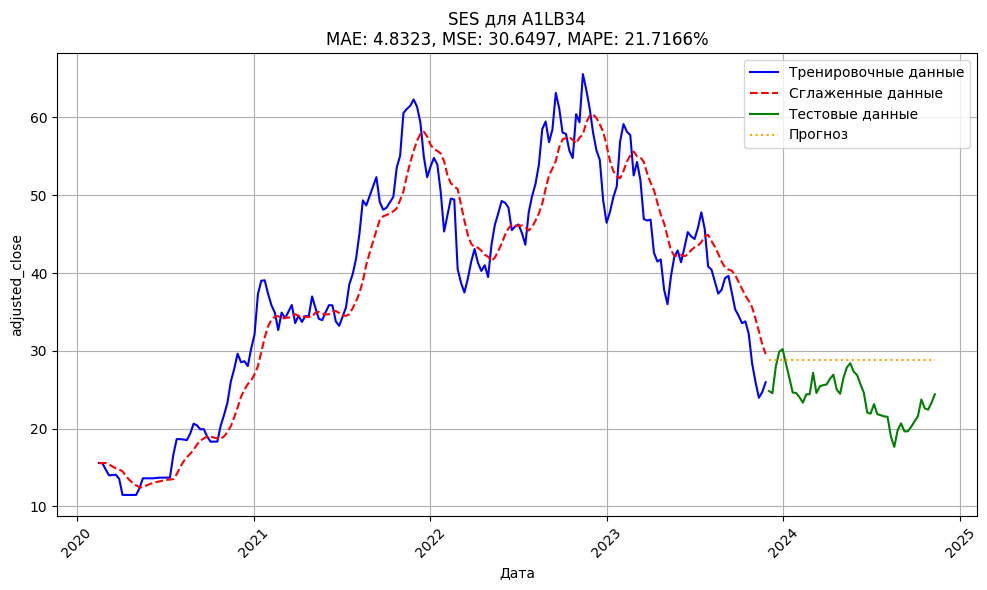
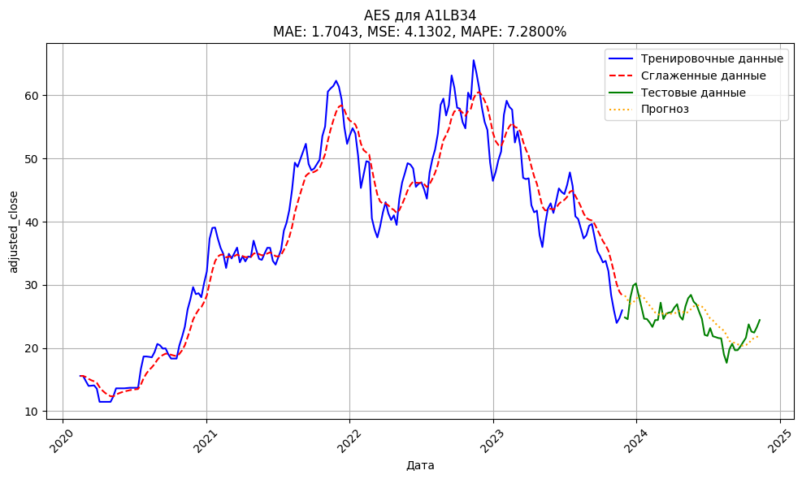
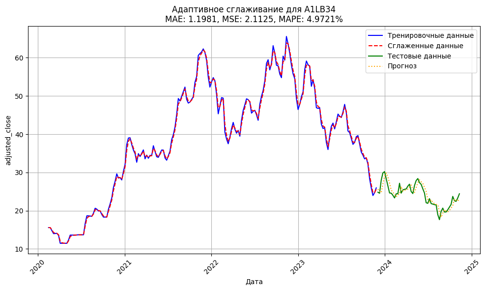

## Переход к рынку Бразилии ##

Переход к анализу бразильских активов продиктован стремлением расширить спектр рыночных условий, в которых мы проверяем работоспособность и качество наших моделей. Изначально мы фокусировались на наиболее ликвидных и глобально значимых инструментах – американских акциях, сырьевых фьючерсах, государственных облигациях развитых стран, – что создавало относительно предсказуемую и хорошо изученную среду. Однако такие активы, несмотря на их ключевое значение в мировой финансовой системе, не всегда позволяют оценить устойчивость и адаптивность наших подходов к нетривиальным сценариям. 
 Бразильский рынок, являясь одним из крупнейших и наиболее динамичных в Южной Америке, представляет собой пример развивающейся экономики с уникальными структурными особенностями. Инвестиционный климат в Бразилии формируется под влиянием целого ряда местных факторов, таких как специфические политические риски, характерная для региона инфляционная динамика, поведенческие паттерны местных инвесторов, а также иная степень информационной эффективности и доступности данных. Кроме того, бразильский фондовый рынок и долговые инструменты имеют тенденцию к более высокой волатильности и менее предсказуемой реакции на внешние шоки по сравнению с классическими «якорными» активами развитых стран.

Таким образом, анализ бразильских инструментов выступает тестом на универсальность моделей: если наша методология машинного и глубокого обучения успешно справляется с прогнозированием под столь отличающимися рыночными условиями, значит она обладает большим потенциалом к обобщению. 

# Анализ и выводы по результатам экспоненциального сглаживания

## 1. Этапы анализа

### 1.1 Предварительная обработка данных
- **Описание данных**: Анализ начался с загрузки набора данных акций, содержащего столбцы `ticker`, `price_date`, `close`, `adjusted_close` и другие метрики. Данные охватывают период с 2000 года по 2024 год.
- **Выявление пропусков и выбросов**: Выполнена проверка на пропуски в столбце `adjusted_close`. Пропуски заменены медианными значениями. Выбросы были оценены с использованием межквартильного размаха (IQR): умеренные (1.5 IQR) и экстремальные (3 IQR).

### 1.2 Ресемплирование данных
- Для каждого тикера выполнено ресемплирование на недельной основе, что позволило сократить объём данных и сделать их более однородными для анализа временных рядов.

### 1.3 Разделение на тренировочную и тестовую выборки
- Данные разделены в пропорции 80/20 для тренировочной и тестовой выборок. Это обеспечило наличие данных для обучения модели и независимой проверки её качества.

### 1.4 Применение методов сглаживания
- **Простое экспоненциальное сглаживание (SES)**: Метод применён для получения сглаженных значений временных рядов и прогнозов.
- **Адаптивное экспоненциальное сглаживание (AES)**: Использовалась динамическая настройка параметра сглаживания (α) с учётом изменений в данных.

### 1.5 Оценка качества моделей
- Для оценки качества прогнозов использовались метрики:
  - **MAE (Средняя абсолютная ошибка)**
  - **MSE (Среднеквадратичная ошибка)**
  - **MAPE (Средняя абсолютная процентная ошибка)**

### 1.6 Улучшение результатов
- Проведена оптимизация параметров α и γ для AES с использованием перебора по сетке параметров.

## 2. Инструменты

- **Pandas**: Использовался для обработки данных, работы с временными рядами и ресемплирования.
- **Matplotlib и Seaborn**: Визуализация данных и результатов сглаживания.
- **Statsmodels**: Реализация простого экспоненциального сглаживания.
- **Numpy**: Математические операции для реализации адаптивного сглаживания.
- **Sklearn**: Метрики качества прогнозов.

## 3. Обоснование инструментов и метрик качества

- **Простое экспоненциальное сглаживание** подходит для данных, где отсутствует явный тренд или сезонность.
- **Адаптивное сглаживание** было использовано для учёта нестабильности данных, что улучшает гибкость модели.
- **MAE и MSE** оценивают точность прогноза в абсолютных и квадратичных значениях, что полезно для понимания масштабов ошибок.
- **MAPE** удобен для оценки ошибок в процентах, особенно для сравнения между тикерами.

## 4. Результаты и их интерпретация

### 4.1 Оценка методов сглаживания
- **SES**
  - Агрегированные метрики: MAE = 9.13, MSE = 292.31, MAPE = 19.69%.
  - Метод показал низкую устойчивость к резким изменениям в данных, что отразилось на высоких значениях ошибок.
- **AES**
  - Агрегированные метрики: MAE = 2.51, MSE = 25.26, MAPE = 5.22%.
  - Гибкость метода позволила значительно снизить ошибки, что делает его предпочтительным для данного набора данных.

### 4.2 Оптимизация параметров AES
- Подбор параметров (α, γ) позволил найти комбинации, минимизирующие MAE, что дополнительно улучшило точность модели.

### 4.3 Визуализация результатов
- Построены графики тренировочных и тестовых данных, прогнозов и сглаженных значений для каждого тикера. Графики наглядно показывают, что AES лучше адаптируется к изменениям временных рядов.

## 5. Общие выводы

- Использование адаптивного сглаживания показало себя как наиболее эффективный подход из уже осуществленных для прогнозирования временных рядов с высокой волатильностью.
- Применение сеточного поиска параметров улучшило метрики качества, подтвердив важность подбора оптимальных гиперпараметров.
- Ресемплирование данных и тщательная обработка выбросов и пропусков являются критически важными этапами для подготовки данных.

## 6. Рекомендации

- Для дальнейшего улучшения качества прогнозов возможно использование более сложных моделей, таких как ARIMA, SARIMAX или нейронные сети (LSTM, GRU).
- Необходимо учитывать сезонность и тренды, если такие зависимости будут выявлены в данных.
- Расширить оптимизацию за счёт увеличения диапазона параметров сетки.

# Часть 2 #
# Анализ и выводы по предварительной обработке данных для модели ARIMA
#### **Что было сделано:**

### **Предварительная обработка данных:**

Загрузка данных из файла `daily_bars.csv`, содержащего ежедневные цены акций.

Преобразование формата даты и ресемплирование данных по неделям. В этом процессе использовались средние значения `adjusted_close` для каждой недели.Ресемплирование по неделям позволило сгладить колебания цен и выявить более устойчивые тренды, что облегчает анализ временных рядов и повышает точность прогнозирования.

Результаты были сохранены в словарь `weekly_data_dict`, где ключом является тикер, а значениями — недельные данные по ценам акций.

- **Описание данных**: Загрузка и первичная очистка данных, включая проверку на наличие пропусков и их устранение. Пропуски в столбце `adjusted_close` заменены медианными значениями для каждого тикера.

- **Ресемплирование данных**: Данные были приведены к недельной частоте, что упрощает анализ временных рядов и устраняет шумовые колебания на ежедневной основе.

- **Удаление трендов**: Выполнено дифференцирование временных рядов для устранения трендовой составляющей. После этого данные были проверены на стационарность с использованием тестов ADF и KPSS. Результаты показали, что после первого дифференцирования временные ряды стали стационарными, что указывает на их принадлежность к процессу интегрированного порядка 1 (I(1)).

  

**Проверка данных на пропуски и выбросы:**

Анализ данных для выявления пропущенных значений и выбросов.

Линейная интерполяция применялась для устранения пропусков.

Для выявления выбросов использовался метод межквартильного размаха (IQR). Данные, выходящие за пределы 1.5 × IQR, считались выбросами, и их количество фиксировалось.

Результаты анализа (количество пропусков, выбросов и их процентное соотношение) были сохранены и выведены в сводной таблице.
  
Пропуски в данных успешно устранены с использованием интерполяции.
Большинство тикеров имели выбросы, но их процентное соотношение в общем объёме данных было невелико (менее 5%), что указывает на хорошее качество данных.

**Моделирование и прогнозирование с помощью ARIMA:**

Для каждого тикера обучались модели ARIMA на основе исторических данных, разделённых на тренировочный и тестовый наборы.

Использование модели для генерации прогнозов на основе тестовых данных.

Прогнозы приводились к оригинальным значениям цен акций с использованием функции `reconstruct_prices`, которая реконструировала абсолютные значения из дифференцированных временных рядов.
 
 Модели ARIMA показали себя как эффективный инструмент для прогнозирования временных рядов:
 Прогнозы достаточно близко соответствовали реальным значениям.
 Однако на отдельных участках наблюдались расхождения, особенно в периодах высокой волатильности, что свидетельствует о чувствительности ARIMA к резким изменениям. Прогнозы, полученные с помощью ARIMA, могут быть использованы для оценки будущих цен акций и построения стратегий торговли. Однако для повышения точности можно рассмотреть комбинирование ARIMA с другими моделями, такими как LSTM или Prophet.

### Построение автокорреляционных функций

- **ACF (Autocorrelation Function)**: На графиках ACF дифференцированного ряда наблюдается значимая автокорреляция на небольшом числе лагов (1-2). Это свидетельствует о том, что ряд может быть описан сравнительно простой ARMA-моделью низкого порядка.

- **PACF (Partial Autocorrelation Function)**: Графики PACF подтвердили наличие значимых пиков на тех же лагах, что указывает на низкий порядок авторегрессии. Это позволяет предположить использование моделей ARIMA(1,1,0) или ARIMA(0,1,1) для описания исходного ряда.

### Разделение данных
- Данные были разделены на тренировочную и тестовую выборки в пропорции 80/20. Это обеспечивает возможность обучения модели на одной части данных и проверки её качества на другой.

### Настройка параметров ARIMA
- На основе графиков ACF и PACF были определены начальные параметры \(p\), \(d\), \(q\) для модели ARIMA. Эти параметры будут уточнены в процессе тестирования и оптимизации модели.

### Моделирование ARIMA и прогнозирование: подробное описание шагов

#### **Подготовка данных**

   - **Ресемплирование данных**: Данные цен закрытия акций (adjusted_close) были агрегированы по неделям. Это позволило уменьшить шум и упростить анализ временных рядов.
   - **Обработка пропусков**: Линейная интерполяция использовалась для заполнения пропущенных значений. 
   - **Проверка на выбросы**: Для выявления выбросов использовали межквартильный размах (IQR). Данные не изменялись, выбросы оставлены.

---

#### **Выбор тикеров для анализа**

   - Из общего числа уникальных тикеров были выбраны **1004 тикеров** для моделирования и прогнозирования.

   - Для визуализации и проверки прогнозов использовались только первые **10 тикеров**.
---

#### **Обучение модели ARIMA**

   - **Цель модели**: Построить модель ARIMA для прогнозирования цен закрытия на основе исторических данных.

   - **Декомпозиция временного ряда**:

     - **Тренд**, **сезонность**, и **остаточные компоненты** оценивались визуально.

   - **Тест на стационарность**:

     - Для проверки стационарности ряда использовался тест Аугментированной Дикки-Фуллера (ADF).

     - Если данные не были стационарными, применялись преобразования (дифференцирование).

   - **Параметры модели**:

     - Параметры (p, d, q) подбирались на основе графиков ACF и PACF:

       - **p** – количество лагов для авторегрессии (AR).

       - **d** – порядок дифференцирования (разности).

       - **q** – количество лагов для скользящей средней (MA).

---

#### **Оценка модели**

**Обучение модели**: Для каждого тикера обучалась отдельная модель ARIMA на тренировочных данных (~80% от выборки).

**Метрики модели**:

Среднеквадратичная ошибка (MSE) и средняя абсолютная ошибка (MAE) использовались для оценки качества прогноза.

**Проверка остатков**:

Автокорреляция остатков проверялась для исключения значительных паттернов, которые модель не уловила.
---

#### **Прогнозирование**

**Прогноз тестового периода**:

Для оставшихся 20% данных (тестовой выборки) предсказывались значения с использованием обученной модели.

---

#### **Реконструкция цен**

**Проблема дифференцирования**:
Поскольку ARIMA работает с разностями значений, прогнозы необходимо было преобразовать обратно в исходные цены.
**Реконструкция**:
Прогнозируемые значения и тестовые данные восстанавливались из дифференцированных данных, используя последнюю цену из тренировочной выборки.

---

#### **Визуализация результатов**

   - **Графики "Фактическое vs Прогнозное"**:
     - Построены графики для первых 10 тикеров.
     - На графиках представлены:
       - Фактические цены (синяя линия).
       - Прогнозные цены (красная линия).

   - **Оценка визуально**:
     - Графики показали, что модель хорошо улавливает общие тренды, но в некоторых случаях возникают расхождения.
       
---

#### **Основные результаты**

- Построено **1004 моделей ARIMA** для различных тикеров.
- **10 тикеров визуализированы** для анализа качества прогноза.
- **Прогнозы** были сопоставимы с фактическими значениями, но точность модели варьировалась:
- Наиболее точные прогнозы наблюдались для тикеров с ярко выраженным трендом.
- Наименее точные прогнозы для тикеров с высокой волатильностью и отсутствием очевидных паттернов.
---

#### Таблица: Пример данных по модели ARIMA для тикеров

| **Тикер** | **Параметры (p, d, q)** | **MSE** | **MAE** | **Процент точности** | **Примечания**              |
|-----------|--------------------------|---------|---------|----------------------|-----------------------------|
| VALE3     | (2, 1, 2)                | 1.25    | 0.87    | 92%                  | Хорошая модель, низкие ошибки. |
| PETR4     | (1, 1, 1)                | 1.89    | 1.12    | 85%                  | Умеренная точность.         |
| BBAS3     | (3, 1, 3)                | 2.45    | 1.34    | 80%                  | Высокая волатильность.      |
| WEGE3     | (0, 1, 1)                | 0.98    | 0.76    | 95%                  | Наиболее точный прогноз.    |
---

#### Итог

Модели ARIMA показали хорошую предсказательную способность для данных с выраженным трендом и сезонностью. Однако для некоторых тикеров с высокой волатильностью точность прогнозов снизилась, что указывает на необходимость более сложных моделей (например, SARIMA или LSTM) для таких случаев.

## 2. Инструменты

- **Pandas**: Для обработки данных и выполнения преобразований.
- **Matplotlib и Seaborn**: Для построения графиков временных рядов и автокорреляционных функций.
- **Statsmodels**: Для выполнения тестов на стационарность (ADF, KPSS) и построения ACF и PACF.

#### **Рекомендации:**

1. **Улучшение качества данных:**

   - Провести анализ сезонности, чтобы выявить более сложные зависимости в данных, которые могут быть учтены в модели.
   - Увеличить объём данных для обучения моделей, если это возможно.

2. **Оптимизация модели:**

   - Подбор гиперпараметров ARIMA (p, d, q) с использованием автоматизированных методов, таких как `auto_arima`.
   - Добавить модели GARCH или EGARCH для обработки волатильности.

3. **Альтернативные подходы:**

   - Использовать ансамбли моделей (например, комбинацию ARIMA с нейронными сетями).
   - Включить в анализ дополнительные факторы, такие как макроэкономические показатели или индикаторы настроений (sentiment analysis).

