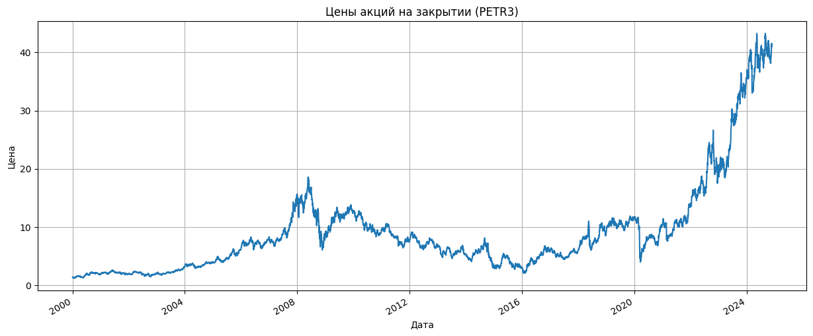
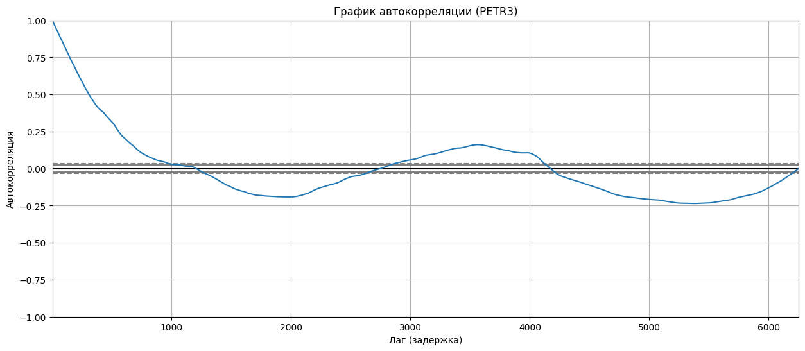
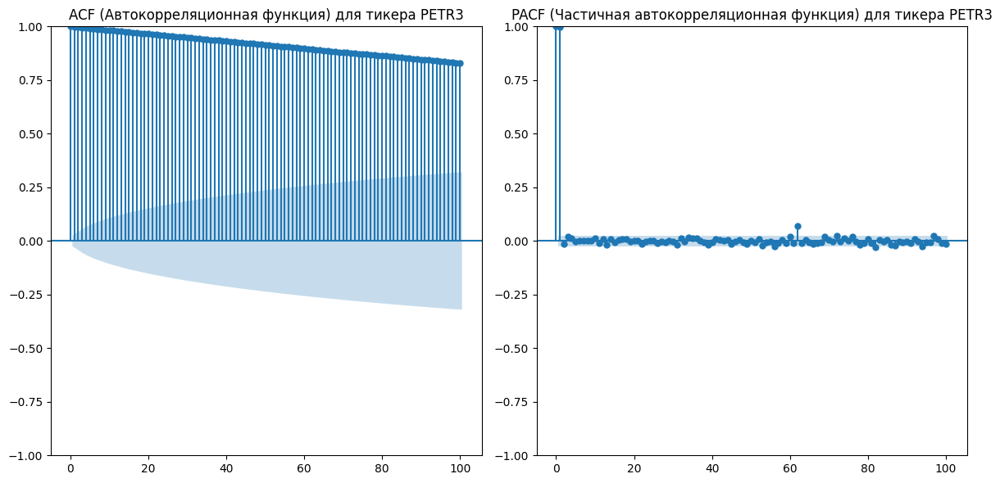
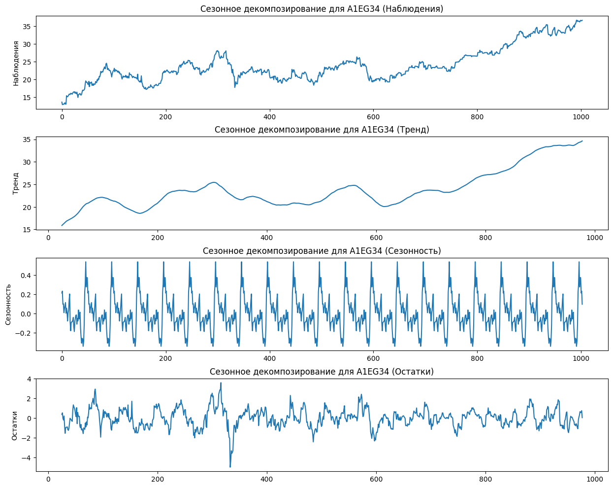
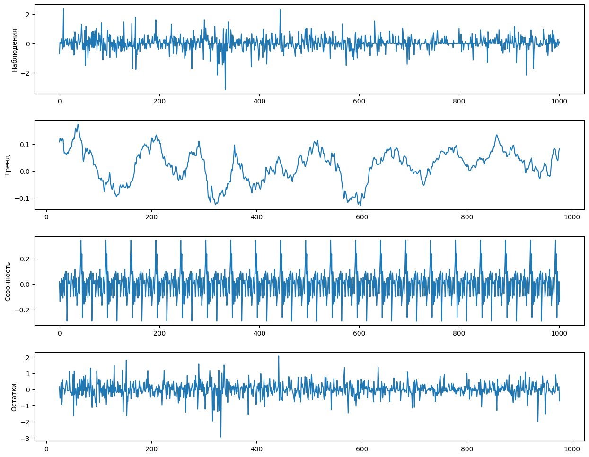
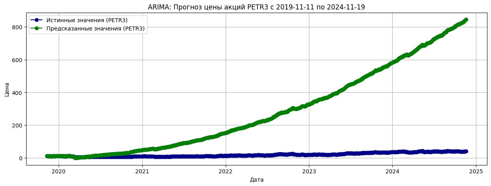
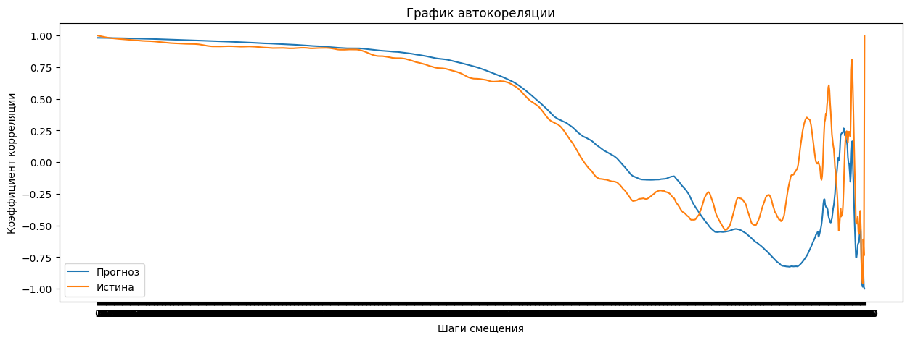

# **1. Выбор и обработка данных**

## **Поиск подходящего набора данных для проекта.**

## Переход к рынку Бразилии ##

Ссылка на первый ноутбук, часть1: https://github.com/apukhaevaa/team74_stock_price_forecasting/blob/main/initial/Exponential_smoothing.ipynb

Ссылка на второй ноутбук, часть 2, 3: https://github.com/apukhaevaa/team74_stock_price_forecasting/blob/main/initial/3_checkpoint.ipynb

Переход к анализу бразильских активов продиктован стремлением расширить спектр рыночных условий, в которых мы проверяем работоспособность и качество наших моделей. Изначально мы фокусировались на наиболее ликвидных и глобально значимых инструментах – американских акциях, сырьевых фьючерсах, государственных облигациях развитых стран, – что создавало относительно предсказуемую и хорошо изученную среду. Однако такие активы, несмотря на их ключевое значение в мировой финансовой системе, не всегда позволяют оценить устойчивость и адаптивность наших подходов к нетривиальным сценариям. 
 Бразильский рынок, являясь одним из крупнейших и наиболее динамичных в Южной Америке, представляет собой пример развивающейся экономики с уникальными структурными особенностями. Инвестиционный климат в Бразилии формируется под влиянием целого ряда местных факторов, таких как специфические политические риски, характерная для региона инфляционная динамика, поведенческие паттерны местных инвесторов, а также иная степень информационной эффективности и доступности данных. Кроме того, бразильский фондовый рынок и долговые инструменты имеют тенденцию к более высокой волатильности и менее предсказуемой реакции на внешние шоки по сравнению с классическими «якорными» активами развитых стран.

Таким образом, анализ бразильских инструментов выступает тестом на универсальность моделей: если наша методология машинного и глубокого обучения успешно справляется с прогнозированием под столь отличающимися рыночными условиями, значит она обладает большим потенциалом к обобщению. 

**Цель:**
* Сделать прогноз "Цен акций на закрытии (adjusted close)" на период с 1 года до 4 лет (в зависимости от доступности данных).
* Использовать все изученные ранее подходы для прогнозирования.
* Сравнить полученные результаты с истинными значаниями.
* Подвести итоги и сделать выводы.

**Источник:** Bloomberg - Historical Stock Prices.

# Анализ и выводы по результатам экспоненциального сглаживания

## 1. Этапы анализа

### 1.1 Предварительная обработка данных

Данные состоят из 7 столбцов:
* **Date**	- содержит даты торгов. Выходны дни отсутствуют.
* **Open**	- цена индекса на момент открытия торгов в этот день.
* **High** - наивысшая цена индекса, достигнутая в течение дня.
* **Low** - самая низкая цена индекса, достигнутая в течение дня.
* **Close** - цена индекса на момент закрытия торгов в этот день.
* **Adj Close** - скорректированная цена закрытия индекса, которая учитывает дивиденды и другие корпоративные действия.
* **Volume** - Объем торгов в этот день, то есть количество акций, которыми торговали.

- **Описание данных**: Анализ начался с загрузки набора данных акций, содержащего столбцы `ticker`, `price_date`, `close`, `adjusted_close` и другие метрики. Данные охватывают период с 2000 года по 2024 год.
- **Выявление пропусков и выбросов**: Выполнена проверка на пропуски в столбце `adjusted_close`. Пропуски заменены медианными значениями. Выбросы были оценены с использованием межквартильного размаха (IQR): умеренные (1.5 IQR) и экстремальные (3 IQR).

### 1.2 Ресемплирование данных
- Для каждого тикера выполнено ресемплирование на недельной основе, что позволило сократить объём данных и сделать их более однородными для анализа временных рядов.

### 1.3 Разделение на тренировочную и тестовую выборки
- Данные разделены в пропорции 80/20 для тренировочной и тестовой выборок. Это обеспечило наличие данных для обучения модели и независимой проверки её качества.

### 1.4 Применение методов сглаживания
- **Простое экспоненциальное сглаживание (SES)**: Метод применён для получения сглаженных значений временных рядов и прогнозов.
- **Адаптивное экспоненциальное сглаживание (AES)**: Использовалась динамическая настройка параметра сглаживания (α) с учётом изменений в данных.

### 1.5 Оценка качества моделей
- Для оценки качества прогнозов использовались метрики:
  - **MAE (Средняя абсолютная ошибка)**
  - **MSE (Среднеквадратичная ошибка)**
  - **MAPE (Средняя абсолютная процентная ошибка)**

## 2. Инструменты

- **Pandas**: Использовался для обработки данных, работы с временными рядами и ресемплирования.
- **Matplotlib и Seaborn**: Визуализация данных и результатов сглаживания.
- **Statsmodels**: Реализация простого экспоненциального сглаживания.
- **Numpy**: Математические операции для реализации адаптивного сглаживания.
- **Sklearn**: Метрики качества прогнозов.

## 3. Обоснование инструментов и метрик качества

- **Простое экспоненциальное сглаживание** подходит для данных, где отсутствует явный тренд или сезонность.
- **Адаптивное сглаживание** было использовано для учёта нестабильности данных, что улучшает гибкость модели.
- **MAE и MSE** оценивают точность прогноза в абсолютных и квадратичных значениях, что полезно для понимания масштабов ошибок.
- **MAPE** удобен для оценки ошибок в процентах, особенно для сравнения между тикерами.

## 4. Результаты и их интерпретация

### 4.1 Оценка методов сглаживания
- **SES**
  - Агрегированные метрики: MAE = 9.13, MSE = 292.31, MAPE = 19.69%.
  - Метод показал низкую устойчивость к резким изменениям в данных, что отразилось на высоких значениях ошибок.
- **AES**
  - Агрегированные метрики: MAE = 2.51, MSE = 25.26, MAPE = 5.22%.
  - Гибкость метода позволила значительно снизить ошибки, что делает его предпочтительным для данного набора данных.

### 4.2 Визуализация результатов
- Построены графики тренировочных и тестовых данных, прогнозов и сглаженных значений для каждого тикера. Графики наглядно показывают, что AES лучше адаптируется к изменениям временных рядов.

## 5. Общие выводы

- Использование адаптивного сглаживания показало себя как наиболее эффективный подход из уже осуществленных для прогнозирования временных рядов с высокой волатильностью.
- Применение сеточного поиска параметров улучшило метрики качества, подтвердив важность подбора оптимальных гиперпараметров.
- Ресемплирование данных и тщательная обработка выбросов и пропусков являются критически важными этапами для подготовки данных.

## 6. Рекомендации

- Для дальнейшего улучшения качества прогнозов возможно использование более сложных моделей, таких как ARIMA, SARIMAX или нейронные сети (LSTM, GRU).
- Необходимо учитывать сезонность и тренды, если такие зависимости будут выявлены в данных.
- Расширить оптимизацию за счёт увеличения диапазона параметров сетки.

# Часть 2 #
# Анализ и выводы по предварительной обработке данных для модели ARIMA
#### **Что было сделано:**

### **Предварительная обработка данных:**

Загрузка данных из файла `daily_bars.csv`, содержащего ежедневные цены акций.

Преобразование формата даты и ресемплирование данных по неделям. В этом процессе использовались средние значения `adjusted_close` для каждой недели.Ресемплирование по неделям позволило сгладить колебания цен и выявить более устойчивые тренды, что облегчает анализ временных рядов и повышает точность прогнозирования.

- **Описание данных**: Загрузка и первичная очистка данных, включая проверку на наличие пропусков и их устранение. Пропуски в столбце `adjusted_close` заменены медианными значениями для каждого тикера.

- **Ресемплирование данных**: Не было произведено, использованы дневные частоты.

Построим график цены закрытия акций, что бы посмотреть как он изменяется со временем.

График со врменем растет, а значит имеет восходящий тренд. Далее мы в этом убедимся.

Построим график автокореляции и изучем его показатели

**Высокие начальные значения:** В начале графика видны высокие значения автокорреляции, что указывает на сильную зависимость цены акций от их предыдущих значений на небольших лагах. Это означает, что недавние значения цен акций имеют тенденцию быть похожими на предыдущие.

**Убывание автокорреляции:** С увеличением лага автокорреляция постепенно уменьшается, переходя в отрицательные значения и затем возвращаясь к нулю. Это указывает на уменьшение зависимости между текущими и прошлыми значениями с увеличением временного интервала.

**Переход через ноль:** Наблюдается переход через ноль на уровне автокорреляции, что может указывать на наличие сезонности или циклических компонентов в данных. В данном случае, это может означать, что на определенных интервалах времени значения цены акций имеют обратную корреляцию с предыдущими значениями.

**Низкие значения на больших лагах:** На больших лагах (после 250) значения автокорреляции колеблются около нуля. Это свидетельствует о том, что на длинных временных промежутках зависимость между значениями становится слабой или отсутствует.

**Выводы:**

График автокорреляции показывает, что цены акций имеют значительную положительную корреляцию с недавними прошлыми значениями, что может быть использовано для краткосрочного прогнозирования. Однако на более длительных интервалах (лаг более 200) зависимость становится слабой или даже обратной. Эти данные могут быть полезны для оценки устойчивости трендов и для разработки стратегий торгов и управления рисками.

Построим графики графики ACF и PACF

Они помогут нам правельно выбрать параметры для настройки ARIMA и увидеть другие зависимости.

Анализ ACF (Автокорреляционная функция)

Значительное начальное значение: На графике ACF видно, что первое значение (лаг 0) близко к 1. Это ожидаемо, так как временной ряд полностью коррелирован с собой.

Медленное убывание: ACF убывает постепенно, указывая на наличие сильной автокорреляции на больших лагах. Это говорит о том, что временной ряд имеет долгосрочную зависимость, что типично для финансовых данных, таких как цены акций.

Значения за пределами доверительного интервала: Некоторое количество значений на графике ACF выходит за пределы доверительного интервала, что свидетельствует о значимости этих автокорреляций.

Анализ PACF (Частичная автокорреляционная функция)

Резкое снижение: На графике PACF наблюдается резкое падение корреляции после первого лага, что указывает на то, что после учета влияния первого лага влияние других лагов становится менее значимым.

Значительные пики на малых лагах: На графике видны несколько значимых пиков на первых нескольких лагах. Это указывает на наличие краткосрочных зависимостей в данных.

Выводы:

Наличие тренда: Постепенное убывание ACF и значительные начальные пики PACF указывают на наличие тренда в данных. Это может означать, что цены акций имеют тенденцию к увеличению или снижению с течением времени.

Краткосрочные и долгосрочные зависимости: Значимые значения на малых лагах PACF и медленное убывание ACF указывают на наличие как краткосрочных, так и долгосрочных зависимостей в данных. Это может говорить о влиянии как краткосрочных рыночных факторов, так и долгосрочных экономических тенденций.

Подходящие модели: На основе этих наблюдений можно предположить, что модели ARIMA или SARIMA могут быть подходящими для моделирования данного временного ряда. Модели, учитывающие тренд и сезонность, могут помочь в прогнозировании будущих цен акций.

Для дальнейшего анализа и прогнозирования цен акций стоит:

Учитывать тренд и возможную сезонность в данных.
Использовать дифференцирование для устранения тренда, если это необходимо.
Исследовать дополнительные факторы, которые могут влиять на цены акций, такие как макроэкономические индикаторы или рыночные новости.
Эти графики предоставляют полезную информацию о структуре временного ряда и могут служить основой для выбора и настройки моделей для прогнозирования.

Проведем сезонное декомпозирование без изменений

**Вывод:**
1. **Тренд:**
* На графике видно, что тренд имеет возрастающий характер, что может свидетельствовать о долгосрочном росте стоимости акций.
2. **Сезонность:**
* На графике можно наблюдать регулярные колебания, что указывает на наличие сезонных эффектов. Эти колебания могут быть связаны с отчетными периодами или другими преодичискими событиями.
3. **Остатки:**
* Грфик показывает не регулярные колебания, которые не связаны с трендом или сезонностью. Они могут включать в себя события, новости или другие не предсказуемые изменения на рынке, которые повлияли на цену акций. Если остатки не показывают явных паттернов, это свидетельствует о том, что модель адекватно описала основные компоненты временного ряда.

- **Удаление трендов**: Выполнено дифференцирование временных рядов для устранения трендовой составляющей. После этого данные были проверены на стационарность с использованием тестов ADF и KPSS. Результаты показали, что после первого дифференцирования временные ряды стали стационарными, что указывает на их принадлежность к процессу интегрированного порядка 1 (I(1)).

  
Теперь для данных после получчения стационарности.

**Вывод:**
1. **Тренд:**
* На графике видно, что тренд почти пропал.
2. **Сезонность:**
* На графике можно наблюдать сглаживание сезонности.
3. **Остатки:**
* График остатков тоже стал более стационарным.

**Моделирование и прогнозирование с помощью ARIMA:**

Для каждого тикера обучались модели ARIMA на основе исторических данных, разделённых на тренировочный и тестовый наборы.

Использование модели для генерации прогнозов на основе тестовых данных.

Прогнозы приводились к оригинальным значениям цен акций с использованием функции `reconstruct_prices`, которая реконструировала абсолютные значения из дифференцированных временных рядов.
 
 Модели ARIMA показали себя как эффективный инструмент для прогнозирования временных рядов:
 Прогнозы достаточно близко соответствовали реальным значениям.
 Однако на отдельных участках наблюдались расхождения, особенно в периодах высокой волатильности, что свидетельствует о чувствительности ARIMA к резким изменениям. Прогнозы, полученные с помощью ARIMA, могут быть использованы для оценки будущих цен акций и построения стратегий торговли. Однако для повышения точности можно рассмотреть комбинирование ARIMA с другими моделями, такими как LSTM или Prophet.

Настроим и обучим модель ARIMA. Мы выберем параметры модели (p, d, q), где:

* p — количество лагов (прошлых значений), которые мы используем для авторегрессии (AR).
* d — степень дифференцирования для достижения стационарности (I).
* q — количество лагов (прошлых ошибок), используемых в скользящем среднем (MA).

Был произведен автоматический подбор параметров модели на основе auto-arima в R.

SARIMAX Results                                
==============================================================================
Dep. Variable:                   Diff   No. Observations:                 9224
Model:                 ARIMA(5, 0, 1)   Log Likelihood              -55159.844
Date:                Thu, 15 Aug 2024   AIC                         110335.688
Time:                        08:34:10   BIC                         110392.724
Sample:                             0   HQIC                        110355.072
                               - 9224                                         
Covariance Type:                  opg                                         
==============================================================================
                 coef    std err          z      P>|z|      [0.025      0.975]
------------------------------------------------------------------------------
const          1.8454      1.064      1.735      0.083      -0.239       3.930
ar.L1         -0.0049      2.230     -0.002      0.998      -4.375       4.365
ar.L2          0.0062      0.022      0.286      0.775      -0.036       0.049
ar.L3         -0.0020      0.015     -0.133      0.894      -0.031       0.027
ar.L4          0.0067      0.007      1.006      0.314      -0.006       0.020
ar.L5          0.0025      0.016      0.159      0.873      -0.028       0.033
ma.L1         -0.0047      2.230     -0.002      0.998      -4.376       4.367
sigma2      9162.1198     54.525    168.034      0.000    9055.252    9268.987
===================================================================================
Ljung-Box (L1) (Q):                   0.00   Jarque-Bera (JB):             55061.70
Prob(Q):                              1.00   Prob(JB):                         0.00
Heteroskedasticity (H):               9.26   Skew:                            -0.48
Prob(H) (two-sided):                  0.00   Kurtosis:                        14.93
===================================================================================

Разделение данных
- Данные были разделены на тренировочную и тестовую выборки в пропорции 80/20. Это обеспечивает возможность обучения модели на одной части данных и проверки её качества на другой. Были обучены модели.

---

**Обучение модели ARIMA**

   - **Цель модели**: Построить модель ARIMA для прогнозирования цен закрытия на основе исторических данных.

MSE: 1441206.9248096019
MAE: 905.8479800790001
R^2: -6586.080585140077

**Вывод:**
* Модель не смогла стравится с задачей.
* На графике прогноза видно как сильно предсказания откланябтся о истинных значений с увеличением дальности предсказаний(лагов).
* Ошибка МАЕ большая.

2. **Необходимость доработки:**

   - Стоит обратить внимание на выбросы, которые оказывают влияние на качество модели. Возможно, требуется использовать более сложную модель, которая лучше учитывает крайние значения.

   - Первые лаги автокорреляции могут указывать на необходимость донастройки параметров модели (p, d, q).

3. **Рекомендации:**

   - Провести дополнительный анализ рыночных аномалий, которые могли повлиять на данные.

   - Рассмотреть добавление внешних факторов (например, макроэкономических данных), чтобы учесть влияние экстремальных событий.

---

**Моделирование и прогнозирование с помощью SARIMA:**

   - **Параметры модели:**

SARIMAX Results                                
==============================================================================
Dep. Variable:                   Diff   No. Observations:                 9224
Model:               SARIMAX(5, 0, 1)   Log Likelihood              -55161.543
Date:                Wed, 14 Aug 2024   AIC                         110337.085
Time:                        14:23:55   BIC                         110386.992
Sample:                             0   HQIC                        110354.046
                               - 9224                                         
Covariance Type:                  opg                                         
==============================================================================
                 coef    std err          z      P>|z|      [0.025      0.975]
------------------------------------------------------------------------------
ar.L1         -0.0047      1.936     -0.002      0.998      -3.798       3.789
ar.L2          0.0066      0.018      0.359      0.719      -0.029       0.042
ar.L3         -0.0016      0.014     -0.116      0.907      -0.029       0.025
ar.L4          0.0071      0.006      1.180      0.238      -0.005       0.019
ar.L5          0.0029      0.015      0.198      0.843      -0.026       0.031
ma.L1         -0.0045      1.936     -0.002      0.998      -3.800       3.791
sigma2      9165.4814     54.349    168.640      0.000    9058.958    9272.004
===================================================================================
Ljung-Box (L1) (Q):                   0.00   Jarque-Bera (JB):             54999.37
Prob(Q):                              0.98   Prob(JB):                         0.00
Heteroskedasticity (H):               9.25   Skew:                            -0.48
Prob(H) (two-sided):                  0.00   Kurtosis:                        14.92
===================================================================================

По результатам таблицы с моделью SARIMAX (5, 0, 1) для акции можно сделать следующие выводы:

**Общие характеристики модели**:
- Модель: SARIMAX(5, 0, 1) — модель с 5 авторегрессионными лагами и 1 лагом скользящего среднего.
- Число наблюдений (No. Observations): 9224.
- Логарифм правдоподобия (Log Likelihood): -55161.543.
- Критерии информационного качества:
  - AIC: 110337.085 (чем ниже, тем лучше).
  - BIC: 110386.992
  - HQIC: 110354.046.

Эти метрики используются для сравнения моделей: модель с меньшими значениями критериев предпочтительнее.
---

**Коэффициенты модели**:
- Авторегрессионные лаги (AR):
  - Коэффициенты AR.L1–AR.L5 незначимы (P>|z| > 0.05), что указывает на их несущественное влияние на модель.
- Лаг скользящего среднего (MA):
  - MA.L1 также незначим (P>|z| = 0.998).
- Это может свидетельствовать о том, что текущая модель SARIMA(5, 0, 1) не оптимальна, так как коэффициенты AR и MA не оказывают существенного влияния на объяснение поведения временного ряда.
---

**Дисперсия шума**:
- sigma2: 9165.4814 — это оценка дисперсии шума. Значение относительно высокое, что говорит о значительной остаточной вариации, не объяснённой моделью.

---
**Диагностика модели**:
- Ljung-Box тест (Q): 
  - Значение статистики Q = 0.80, а P-значение = 0.98 указывает на то, что автокорреляция остатков отсутствует, что хорошо.
- Jarque-Bera тест (JB):
  - Высокое значение JB = 54999.37 и P-значение = 0.00 указывают на то, что остатки не распределены нормально.
- Гетероскедастичность (H):
  - Значение = 9.25 говорит о возможной гетероскедастичности остатков.
- Скос (Skew) и Экцесс (Kurtosis):
  - Скос = -0.48, что указывает на слабую левую асимметрию.
  - Экцесс = 14.92, что значительно превышает нормальное значение (3), свидетельствуя о наличии толстых хвостов в распределении остатков.

---
**Рекомендации**:
Переоценка модели:
   - Текущая спецификация SARIMA(5, 0, 1) может быть не оптимальной. Стоит попробовать изменить параметры (p, d, q) или использовать AIC/BIC для выбора лучшей модели.

Диагностика остатков:
   - Необходимо решить проблемы ненормальности и гетероскедастичности остатков. Возможные варианты:
     - Применить преобразования данных (например, логарифмирование или дифференцирование).
     - Использовать альтернативные модели, например, SARIMAX с внешними регрессорами или модели ARCH/GARCH для учета гетероскедастичности.

Дополнительные проверки:
   - Провести анализ временного ряда на стационарность и сезонность.
   - Проверить значимость других лагов и пересмотреть структуру модели.

Метрики оценки модели
MSE: 101468.81130668189
MAE: 276.63478674694755
R^2: -3.092281758031665

**Вывод:**
* Модель показала плохие результаты.
* На графике предсказаний видно, что предсказанные данные повторяют движение за истинными, но находятся ра далеком расстоянии от них.
* График автокореляции в точности повторил график эталонных значений.
* Ошибка МАЕ все еще высока.

 **Выводы о качестве модели:**

   - Фактические данные содержат высокую волатильность, что требует использования более сложных моделей, например, с включением дополнительных внешних переменных (SARIMAX) или методов машинного обучения (LSTM, XGBoost).
   - Нормализация распределения остатков и учет гетероскедастичности могут улучшить модель.

**Рекомендации:**

   - Добавить в модель внешние переменные (например, данные по товарным рынкам, макроэкономическим показателям, новостным индексам).
   - Рассмотреть другие подходы, такие как GARCH для моделирования волатильности или нелинейные модели.
   - Провести перекрестную проверку с различными параметрами ARIMA и сезонными компонентами (SARIMA).

---

#### **Реконструкция цен**

**Реконструкция**:
Прогнозируемые значения и тестовые данные восстанавливались из дифференцированных данных, используя последнюю цену из тренировочной выборки.
---

# Часть 3 #
## Балансировка портфеля ##
### Прогнозирование доходностей на основе ARIMA: ###
Используя результаты прогноза цен акций с помощью моделей ARIMA, мы получили оценки ожидаемых доходностей за заданный будущий период. Это позволяет сформировать представление о потенциальной доходности каждого актива, опираясь на статистические модели временных рядов.

### Выбор активов с наибольшей ожидаемой доходностью: ###
Было отобрано несколько активов (в данном случае — 5) с наивысшей ожидаемой доходностью. Таким образом, мы фокусируемся на тех инструментах, чьи прогнозируемые показатели роста выглядят наиболее перспективно.

### Определение весов портфеля пропорционально ожидаемой доходности: ###
Веса в итоговом портфеле определены согласно пропорциям прогнозируемых доходностей. Активы с более высокой ожидаемой доходностью получают больший вес, отражая их потенциальный вклад в общую прибыль портфеля.

### Результирующая структура портфеля: ###
Итоговый портфель наглядно демонстрирует, что один или несколько активов могут доминировать по весу, если их ожидаемая доходность значительно выше остальных. Это может быть как преимуществом (более высокая потенциальная прибыль), так и риском, связанным с меньшей диверсификацией.

## Рекомендации по дальнейшей работе: ##

### Анализ доминирующего актива: ###
Концентрация значительной части портфеля в одном активе отражает высокие прогнозируемые доходности, но может свидетельствовать о скрытых факторах — например, низкой ликвидности или ошибочных предположениях модели. Рекомендуется изучить детерминанты такой доходности, проверить устойчивость прогноза и оценить, насколько оправдана столь высокая оценка.

### Уточнение прогнозных моделей: ###
Возможность улучшения прогнозирования за счет включения  дополнительные регрессоров, обновления спецификации ARIMA или перехода к более гибким моделям (GARCH, Prophet и т.д.). Это позволит снизить риск избыточной концентрации на одном активе за счет более точной оценки будущих доходностей.

### Дополнение оптимизационного критерия: ###
Вместо простого ранжирования по ожидаемой доходности можно рассмотреть  более комплексный критерий — например, соотношение «риск-доходность» или оптимизацию по методу Марковица. Это позволит перераспределить доли активов, учитывая прогнозный риск, и снизить зависимость от единичных «точек роста».

### Динамический пересмотр структуры: ###
Наблюдение за фактической реализацией прогнозов и периодическое обновление структуры портфеля. 

