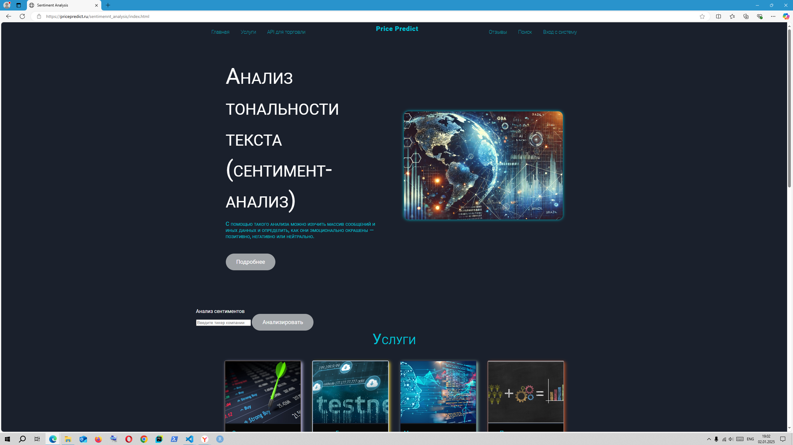
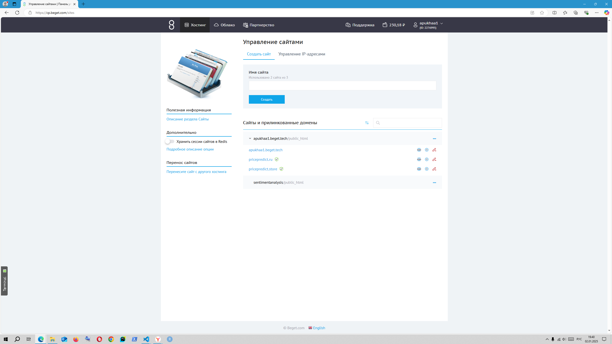
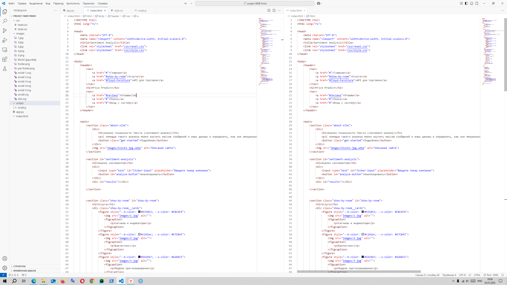

## Анализ тональности текста (анализ сентиментов)

Ссылка на web-сайт: [pricepredict.ru](https://pricepredict.ru/sentimennt_analysis/index.html)

### Содержание  


1. [Инфраструктура](#инфраструктура)  

2. [Frontend](### 2. Frontend)  

3. [Backend](#backend)  

4. [Анализ сентиментов](#анализ-сентиментов)  

5. [Будущие возможности](#будущие-возможности)  

6. [Цель создания сайта](#цель-создания-сайта)  

7. [Как анализ сентиментов помогает в прогнозировании цен акций](#как-анализ-сентиментов-помогает-в-прогнозировании-цен-акций)  


---


### 1. Инфраструктура  

- Веб-сайт "Price Predict" размещён на платном **VPS**, предоставляемом хостинг-платформой [Beget](https://beget.com/).  Ссылка на сайт находится выше.

- Frontend написан на языке программирования **JavaScript** для создания интерактивного интерфейса.  

- Backend реализован на **Python**, что даёт возможность использовать мощные библиотеки для анализа данных и обработки текста.  





---


### 2. Frontend  

Frontend отвечает за отображение интерфейса и взаимодействие пользователя с системой.  

- **Технологии**: HTML, CSS, JavaScript.  

- **Функционал**:  

  - Поле ввода для тикера компании.  

  - Кнопка для запуска анализа сентиментов.  

  - Отображение результата анализа в удобной форме.
    




#### Пример структуры frontend:

Link to index.html: https://github.com/apukhaevaa/team74_stock_price_forecasting/blob/sentiment_analysis_service/sentiment_analysis_service/frontend/index.html

Link to style.css: https://github.com/apukhaevaa/team74_stock_price_forecasting/blob/sentiment_analysis_service/sentiment_analysis_service/frontend/style.css


```plaintext

/frontend

├── css/
│   ├── reset.css      # Сброс стилей для унификации отображения
│   ├── style.css      # Основные стили сайта
├── images/            # Папка с изображениями
│   ├── 1.jpg          # Изображение 1
│   ├── 2.jpg          # Изображение 2
│   ├── 3.jpg          # Изображение 3
│   ├── 4.png          # Изображение 4
│   ├── 5.png          # Изображение 5
│   ├── block1.jpg.webp # Пример webp-изображения
│   ├── footer.png     # Изображение для футера
│   ├── pre-footer.png # Изображение для префутера
│   ├── social-1.svg   # Иконка соцсети 1
│   ├── social-2.svg   # Иконка соцсети 2
│   ├── social-3.svg   # Иконка соцсети 3
│   ├── social-4.svg   # Иконка соцсети 4
│   ├── social-5.svg   # Иконка соцсети 5
│   ├── social.svg     # Общая иконка соцсетей
│   ├── star.svg       # Иконка звезды
├── scripts/
│   ├── script.js      # Основной JavaScript-файл
├── index.html         # Главная страница сайта

```





### 3. Backend  

Backend обрабатывает запросы от пользователя и выполняет вычислительные задачи.  


#### Технологии:  

- Python: Основной язык программирования для backend.  

- **Flask** или **FastAPI**: Фреймворки для создания REST API.  

- NLP-библиотеки: NLTK, SpaCy, Hugging Face Transformers.  


#### Основные функции:  

- Обработка запросов от frontend.  

- Получение данных о компании через интеграцию с внешними API (например, [Yandex.News API](https://yandex.ru/dev/news/) или [VK API](https://vk.com/dev)).  

- Анализ текста с использованием NLP-моделей.  


#### Структуры backend:


```plaintext
/backend
├── main.py            # Основной файл с API логикой
├── sentiment_analysis.py  # Логика анализа сентиментов
├── requirements.txt   # Список зависимостей Python

```


### 4. Анализ сентиментов  

Анализ сентиментов помогает оценить настроение инвесторов и общественности относительно компании.  


#### Этапы анализа:  

1. **Сбор данных**:  

   - Новости о компании.  

   - Финансовые отчёты.  

   - Посты из социальных сетей.  


2. **Предобработка данных**:  

   - Удаление лишнего текста, токенизация и нормализация.  

   - Удаление стоп-слов и преобразование текста.  


3. **Анализ тональности**:  

   - Использование моделей машинного обучения для классификации текста на **позитивный**, **негативный** или **нейтральный**.  

   - Например, [Hugging Face Transformers](https://huggingface.co/) предоставляет готовые модели для анализа тональности.  


### 5. Будущие возможности  

- **Анализ финансовой отчётности**:  

  - Выявление тональности отчётов и её влияния на рынок.  

- **Привязка к моделям прогнозирования цен акций**:  

  - Интеграция результатов сентимент-анализа в машинные модели.  


---


### 6. Цель создания сайта  

Создать инструмент, который объединяет:  

- **Анализ сентиментов**: Автоматическая оценка тональности текстов.  

- **Финансовый анализ**: Использование сентиментов для прогнозирования цен акций.  


Цель — помочь трейдерам и инвесторам принимать решения на основе анализа рыночных настроений и данных.


---


### 7. Как анализ сентиментов помогает в прогнозировании цен акций  

1. **Оценка настроений**:  

   - Позитивные новости способствуют росту цен акций, негативные — снижению.  


2. **Выявление рыночных паттернов**:  

   - Сентименты помогают предвосхитить поведение инвесторов.  


3. **Интеграция с моделями машинного обучения**:  

   - Модели прогнозируют цены, учитывая тональность новостей.  


4. **Прогнозирование рыночных трендов**:  

   - Анализ текстов предоставляет конкурентное преимущество инвесторам.  


--- 


